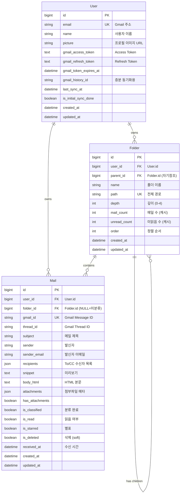

# Pigeon 데이터베이스 설계

> **작성일**: 2025-12-10
> **버전**: v1.0
> **상태**: Draft
> **Database**: SQLite3 + Django ORM

---

## 1. 개요

Pigeon은 Django ORM과 SQLite3를 사용하여 데이터를 관리합니다.

### 1.1 설계 원칙

- **단순성**: MVP에 필요한 최소한의 테이블 구조
- **확장성**: 향후 기능 추가를 고려한 유연한 설계
- **성능**: 자주 사용되는 쿼리에 최적화된 인덱스

---

## 2. ERD (Entity Relationship Diagram)



### 관계 설명

- **Folder 자기참조**: `parent_id`로 트리 구조 형성 (최대 5단계)
- **Mail → Folder**: 분류된 폴더 (NULL이면 미분류)

### 2.1 관계 요약

| 관계 | 설명 |
|------|------|
| User → Folder | 1:N (사용자는 여러 폴더 소유) |
| User → Mail | 1:N (사용자는 여러 메일 소유) |
| Folder → Mail | 1:N (폴더는 여러 메일 포함) |
| Folder → Folder | 1:N 자기참조 (부모-자식 트리 구조) |

---

## 3. 테이블 정의

### 3.1 User (사용자)

Gmail OAuth2 인증된 사용자 정보를 저장합니다.

```python
# apps/accounts/models.py

from django.contrib.auth.models import AbstractUser
from django.db import models
from django.conf import settings
from cryptography.fernet import Fernet


class User(AbstractUser):
    """Gmail OAuth2 인증 사용자"""

    # Gmail 관련 (암호화 저장)
    email = models.EmailField(unique=True)
    _gmail_access_token = models.TextField(db_column='gmail_access_token', blank=True)
    _gmail_refresh_token = models.TextField(db_column='gmail_refresh_token', blank=True)
    gmail_token_expires_at = models.DateTimeField(null=True, blank=True)
    gmail_history_id = models.CharField(max_length=50, blank=True)  # 증분 동기화용

    # 프로필
    name = models.CharField(max_length=100, blank=True)
    picture = models.URLField(blank=True)

    # 동기화 상태
    last_sync_at = models.DateTimeField(null=True, blank=True)
    is_initial_sync_done = models.BooleanField(default=False)

    # 타임스탬프
    created_at = models.DateTimeField(auto_now_add=True)
    updated_at = models.DateTimeField(auto_now=True)

    USERNAME_FIELD = 'email'
    REQUIRED_FIELDS = ['username']

    class Meta:
        db_table = 'users'
        verbose_name = '사용자'
        verbose_name_plural = '사용자들'

    def __str__(self):
        return self.email

    # ===== 토큰 암호화/복호화 =====
    @staticmethod
    def _get_fernet():
        """Fernet 암호화 객체 반환"""
        key = settings.TOKEN_ENCRYPTION_KEY.encode()
        return Fernet(key)

    @property
    def gmail_access_token(self):
        """Access Token 복호화"""
        if not self._gmail_access_token:
            return ''
        try:
            return self._get_fernet().decrypt(
                self._gmail_access_token.encode()
            ).decode()
        except Exception:
            return ''

    @gmail_access_token.setter
    def gmail_access_token(self, value):
        """Access Token 암호화 저장"""
        if value:
            self._gmail_access_token = self._get_fernet().encrypt(
                value.encode()
            ).decode()
        else:
            self._gmail_access_token = ''

    @property
    def gmail_refresh_token(self):
        """Refresh Token 복호화"""
        if not self._gmail_refresh_token:
            return ''
        try:
            return self._get_fernet().decrypt(
                self._gmail_refresh_token.encode()
            ).decode()
        except Exception:
            return ''

    @gmail_refresh_token.setter
    def gmail_refresh_token(self, value):
        """Refresh Token 암호화 저장"""
        if value:
            self._gmail_refresh_token = self._get_fernet().encrypt(
                value.encode()
            ).decode()
        else:
            self._gmail_refresh_token = ''
```

#### 암호화 키 설정

```python
# config/settings/base.py

import os
from cryptography.fernet import Fernet

# 토큰 암호화 키 (환경변수에서 로드)
# 최초 1회 생성: python -c "from cryptography.fernet import Fernet; print(Fernet.generate_key().decode())"
TOKEN_ENCRYPTION_KEY = os.environ.get('TOKEN_ENCRYPTION_KEY')

if not TOKEN_ENCRYPTION_KEY:
    raise ValueError("TOKEN_ENCRYPTION_KEY 환경변수가 설정되지 않았습니다.")
```

```bash
# .env
TOKEN_ENCRYPTION_KEY=your-32-byte-base64-encoded-key-here

# 키 생성 명령어
python -c "from cryptography.fernet import Fernet; print(Fernet.generate_key().decode())"
```

#### 필드 설명

| 필드 | 타입 | 제약조건 | 설명 |
|------|------|----------|------|
| `id` | BigAutoField | PK | 자동 생성 ID |
| `email` | EmailField | UNIQUE, NOT NULL | Gmail 주소 (로그인 ID) |
| `gmail_access_token` | TextField | - | Gmail API Access Token (Fernet 암호화) |
| `gmail_refresh_token` | TextField | - | Gmail API Refresh Token (Fernet 암호화) |
| `gmail_token_expires_at` | DateTimeField | NULL | 토큰 만료 시간 |
| `gmail_history_id` | CharField(50) | - | Gmail 증분 동기화용 history ID |
| `name` | CharField(100) | - | 사용자 이름 |
| `picture` | URLField | - | 프로필 이미지 URL |
| `last_sync_at` | DateTimeField | NULL | 마지막 동기화 시간 |
| `is_initial_sync_done` | BooleanField | DEFAULT FALSE | 초기 동기화 완료 여부 |
| `created_at` | DateTimeField | auto_now_add | 생성 시간 |
| `updated_at` | DateTimeField | auto_now | 수정 시간 |

---

### 3.2 Folder (폴더)

메일 분류를 위한 폴더 구조입니다. 자기 참조로 트리 구조를 형성합니다.

```python
# apps/folders/models.py

from django.db import models
from django.conf import settings


class Folder(models.Model):
    """메일 분류 폴더 (트리 구조)"""

    user = models.ForeignKey(
        settings.AUTH_USER_MODEL,
        on_delete=models.CASCADE,
        related_name='folders'
    )

    # 트리 구조
    name = models.CharField(max_length=100)
    parent = models.ForeignKey(
        'self',
        on_delete=models.CASCADE,
        null=True,
        blank=True,
        related_name='children'
    )
    path = models.CharField(max_length=500)  # 전체 경로: "업무/프로젝트A/회의록"
    depth = models.PositiveSmallIntegerField(default=0)  # 깊이 (0=루트)

    # 통계 (캐시)
    mail_count = models.PositiveIntegerField(default=0)
    unread_count = models.PositiveIntegerField(default=0)

    # 정렬
    order = models.PositiveIntegerField(default=0)

    # 타임스탬프
    created_at = models.DateTimeField(auto_now_add=True)
    updated_at = models.DateTimeField(auto_now=True)

    class Meta:
        db_table = 'folders'
        verbose_name = '폴더'
        verbose_name_plural = '폴더들'
        ordering = ['order', 'name']
        indexes = [
            models.Index(fields=['user', 'path']),
            models.Index(fields=['user', 'parent']),
        ]
        constraints = [
            models.UniqueConstraint(
                fields=['user', 'path'],
                name='unique_user_folder_path'
            )
        ]

    def __str__(self):
        return self.path

    def save(self, *args, **kwargs):
        # 깊이 자동 계산
        if self.parent:
            self.depth = self.parent.depth + 1
            self.path = f"{self.parent.path}/{self.name}"
        else:
            self.depth = 0
            self.path = self.name
        super().save(*args, **kwargs)
```

#### 필드 설명

| 필드 | 타입 | 제약조건 | 설명 |
|------|------|----------|------|
| `id` | BigAutoField | PK | 자동 생성 ID |
| `user_id` | BigInt | FK → users.id, NOT NULL | 소유 사용자 |
| `parent_id` | BigInt | FK → folders.id, NULL | 상위 폴더 (NULL=루트) |
| `name` | CharField(100) | NOT NULL | 폴더 이름 |
| `path` | CharField(500) | NOT NULL | 전체 경로 (예: "업무/프로젝트A") |
| `depth` | SmallInt | DEFAULT 0 | 깊이 (0~4, 최대 5단계) |
| `mail_count` | Int | DEFAULT 0 | 포함된 메일 수 (캐시) |
| `unread_count` | Int | DEFAULT 0 | 읽지 않은 메일 수 (캐시) |
| `order` | Int | DEFAULT 0 | 정렬 순서 |
| `created_at` | DateTimeField | auto_now_add | 생성 시간 |
| `updated_at` | DateTimeField | auto_now | 수정 시간 |

#### 제약조건

- `UNIQUE(user_id, path)`: 같은 사용자 내에서 경로 중복 불가
- `depth <= 4`: 최대 5단계 깊이 제한 (애플리케이션 레벨에서 체크)

---

### 3.3 Mail (메일)

Gmail에서 동기화된 메일 정보입니다.

```python
# apps/mails/models.py

from django.db import models
from django.conf import settings


class Mail(models.Model):
    """Gmail 메일"""

    user = models.ForeignKey(
        settings.AUTH_USER_MODEL,
        on_delete=models.CASCADE,
        related_name='mails'
    )
    folder = models.ForeignKey(
        'folders.Folder',
        on_delete=models.SET_NULL,
        null=True,
        blank=True,
        related_name='mails'
    )

    # Gmail 식별자
    gmail_id = models.CharField(max_length=50)  # Gmail Message ID
    thread_id = models.CharField(max_length=50)  # Gmail Thread ID

    # 메일 내용
    subject = models.CharField(max_length=500, blank=True)
    sender = models.CharField(max_length=200)  # "이름 <email@example.com>"
    sender_email = models.EmailField()
    recipients = models.JSONField(default=list)  # To, CC 수신자 목록
    # [{"type": "to", "email": "a@test.com", "name": "홍길동"}, {"type": "cc", ...}]
    snippet = models.TextField(blank=True)  # 미리보기 텍스트
    body_html = models.TextField(blank=True)  # HTML 본문

    # 첨부파일 메타데이터
    attachments = models.JSONField(default=list)
    # [{"id": "xxx", "name": "file.pdf", "size": 1024, "mimeType": "application/pdf"}]
    has_attachments = models.BooleanField(default=False)

    # 분류 상태
    is_classified = models.BooleanField(default=False)

    # 상태
    is_read = models.BooleanField(default=False)
    is_starred = models.BooleanField(default=False)
    is_deleted = models.BooleanField(default=False)  # Soft delete

    # 시간
    received_at = models.DateTimeField()  # Gmail internalDate
    created_at = models.DateTimeField(auto_now_add=True)
    updated_at = models.DateTimeField(auto_now=True)

    class Meta:
        db_table = 'mails'
        verbose_name = '메일'
        verbose_name_plural = '메일들'
        ordering = ['-received_at']
        indexes = [
            models.Index(fields=['user', 'gmail_id']),
            models.Index(fields=['user', 'folder', '-received_at']),
            models.Index(fields=['user', 'is_read', '-received_at']),
            models.Index(fields=['user', 'is_classified']),
            models.Index(fields=['user', '-received_at']),
        ]
        constraints = [
            models.UniqueConstraint(
                fields=['user', 'gmail_id'],
                name='unique_user_gmail_id'
            )
        ]

    def __str__(self):
        return f"{self.subject[:50]}..." if len(self.subject) > 50 else self.subject
```

#### 필드 설명

| 필드 | 타입 | 제약조건 | 설명 |
|------|------|----------|------|
| `id` | BigAutoField | PK | 자동 생성 ID |
| `user_id` | BigInt | FK → users.id, NOT NULL | 소유 사용자 |
| `folder_id` | BigInt | FK → folders.id, NULL | 분류된 폴더 (NULL=미분류) |
| `gmail_id` | CharField(50) | NOT NULL | Gmail Message ID |
| `thread_id` | CharField(50) | NOT NULL | Gmail Thread ID |
| `subject` | CharField(500) | - | 메일 제목 |
| `sender` | CharField(200) | NOT NULL | 발신자 ("이름 <email>") |
| `sender_email` | EmailField | NOT NULL | 발신자 이메일 |
| `recipients` | JSONField | DEFAULT [] | To, CC 수신자 목록 |
| `snippet` | TextField | - | 미리보기 텍스트 |
| `body_html` | TextField | - | HTML 본문 |
| `attachments` | JSONField | DEFAULT [] | 첨부파일 메타데이터 |
| `has_attachments` | BooleanField | DEFAULT FALSE | 첨부파일 존재 여부 |
| `is_classified` | BooleanField | DEFAULT FALSE | 분류 완료 여부 |
| `is_read` | BooleanField | DEFAULT FALSE | 읽음 여부 |
| `is_starred` | BooleanField | DEFAULT FALSE | 별표 여부 |
| `is_deleted` | BooleanField | DEFAULT FALSE | 삭제 여부 (Soft delete) |
| `received_at` | DateTimeField | NOT NULL | 수신 시간 |
| `created_at` | DateTimeField | auto_now_add | DB 생성 시간 |
| `updated_at` | DateTimeField | auto_now | DB 수정 시간 |

#### 제약조건

- `UNIQUE(user_id, gmail_id)`: 같은 사용자 내에서 Gmail ID 중복 불가

---

## 4. 인덱스 전략

### 4.1 인덱스 목록

```sql
-- User 테이블
CREATE INDEX idx_users_email ON users(email);

-- Folder 테이블
CREATE INDEX idx_folders_user_path ON folders(user_id, path);
CREATE INDEX idx_folders_user_parent ON folders(user_id, parent_id);

-- Mail 테이블
CREATE INDEX idx_mails_user_gmail_id ON mails(user_id, gmail_id);
CREATE INDEX idx_mails_user_folder_received ON mails(user_id, folder_id, received_at DESC);
CREATE INDEX idx_mails_user_is_read_received ON mails(user_id, is_read, received_at DESC);
CREATE INDEX idx_mails_user_is_classified ON mails(user_id, is_classified);
CREATE INDEX idx_mails_user_received ON mails(user_id, received_at DESC);
```

### 4.2 인덱스 사용 시나리오

| 쿼리 패턴 | 사용 인덱스 |
|-----------|------------|
| 폴더별 메일 목록 조회 | `idx_mails_user_folder_received` |
| 읽지 않은 메일 조회 | `idx_mails_user_is_read_received` |
| 미분류 메일 조회 | `idx_mails_user_is_classified` |
| Gmail ID로 메일 조회 | `idx_mails_user_gmail_id` |
| 전체 메일 최신순 조회 | `idx_mails_user_received` |
| 폴더 경로로 조회 | `idx_folders_user_path` |
| 하위 폴더 조회 | `idx_folders_user_parent` |

---

## 5. 주요 쿼리 패턴

### 5.1 폴더별 메일 목록 조회

```python
# 특정 폴더의 메일 목록 (최신순, 페이지네이션)
Mail.objects.filter(
    user=user,
    folder_id=folder_id,
    is_deleted=False
).order_by('-received_at')[:20]
```

### 5.2 읽지 않은 메일 조회 (가상 폴더)

```python
# 읽지 않은 메일 목록
Mail.objects.filter(
    user=user,
    is_read=False,
    is_deleted=False
).order_by('-received_at')
```

### 5.3 미분류 메일 조회

```python
# 분류되지 않은 메일
Mail.objects.filter(
    user=user,
    is_classified=False,
    is_deleted=False
).order_by('-received_at')
```

### 5.4 폴더 트리 조회

```python
# 사용자의 모든 폴더 (트리 구성용)
Folder.objects.filter(user=user).order_by('depth', 'order', 'name')

# Python에서 트리 구조로 변환
def build_folder_tree(folders):
    folder_map = {f.id: {**f.__dict__, 'children': []} for f in folders}
    root_folders = []

    for folder in folders:
        if folder.parent_id:
            folder_map[folder.parent_id]['children'].append(folder_map[folder.id])
        else:
            root_folders.append(folder_map[folder.id])

    return root_folders
```

### 5.5 폴더 통계 업데이트

```python
# 폴더의 메일 수, 읽지 않은 메일 수 업데이트
from django.db.models import Count, Q

stats = Mail.objects.filter(
    folder=folder,
    is_deleted=False
).aggregate(
    mail_count=Count('id'),
    unread_count=Count('id', filter=Q(is_read=False))
)

folder.mail_count = stats['mail_count']
folder.unread_count = stats['unread_count']
folder.save(update_fields=['mail_count', 'unread_count'])
```

### 5.6 Gmail ID로 메일 존재 확인 (동기화 시)

```python
# 이미 동기화된 메일인지 확인
existing_gmail_ids = set(
    Mail.objects.filter(
        user=user,
        gmail_id__in=gmail_ids_to_check
    ).values_list('gmail_id', flat=True)
)

new_gmail_ids = set(gmail_ids_to_check) - existing_gmail_ids
```

---

## 6. 데이터 마이그레이션

### 6.1 초기 마이그레이션

```bash
# 마이그레이션 파일 생성
python manage.py makemigrations accounts folders mails

# 마이그레이션 실행
python manage.py migrate
```

### 6.2 시드 데이터

개발 환경에서 사용할 기본 데이터:

```python
# apps/folders/management/commands/create_default_folders.py

from django.core.management.base import BaseCommand
from apps.folders.models import Folder


class Command(BaseCommand):
    help = '사용자에게 기본 폴더 생성'

    def handle(self, *args, **options):
        # 기본 폴더는 사용자 가입 시 자동 생성
        # 또는 첫 분류 시 AI가 자동 생성
        pass
```

> **Note**: Pigeon에서는 폴더가 AI 분류 결과에 따라 자동 생성되므로, 초기 시드 데이터가 필요 없습니다. 단, "미분류" 폴더는 사용자 생성 시 자동으로 만들어집니다.

---

## 7. 성능 고려사항

### 7.1 SQLite 제약사항

| 항목 | 제한 | 대응 |
|------|------|------|
| 동시 쓰기 | 1개 | 읽기 위주 워크로드에 적합, MVP에 충분 |
| 최대 DB 크기 | 281TB | 문제 없음 |
| 최대 행 수 | 2^64 | 문제 없음 |

### 7.2 쿼리 최적화

- **select_related**: FK 조인 시 사용
  ```python
  Mail.objects.select_related('folder').filter(user=user)
  ```

- **prefetch_related**: 역참조 조회 시 사용
  ```python
  Folder.objects.prefetch_related('children').filter(user=user)
  ```

- **only/defer**: 필요한 필드만 조회
  ```python
  Mail.objects.only('id', 'subject', 'sender', 'received_at', 'is_read')
  ```

### 7.3 캐싱 전략

- 폴더 트리: 변경 시에만 갱신 (mail_count, unread_count)
- 동기화 상태: 메모리 캐시 또는 세션 저장

---

## 8. 보안 고려사항

### 8.1 토큰 저장 (Fernet 암호화)

OAuth2 토큰은 **Fernet 대칭키 암호화**로 저장합니다.

```
┌─────────────────────────────────────────────────────────┐
│                    토큰 암호화 흐름                       │
├─────────────────────────────────────────────────────────┤
│                                                         │
│   [Google OAuth]                                        │
│        │                                                │
│        ▼                                                │
│   Access Token (평문)                                    │
│        │                                                │
│        ▼                                                │
│   Fernet.encrypt() ◄── TOKEN_ENCRYPTION_KEY (.env)     │
│        │                                                │
│        ▼                                                │
│   암호화된 토큰 ──► DB 저장                              │
│                                                         │
│   ─────────────────────────────────────────────────     │
│                                                         │
│   DB에서 조회                                            │
│        │                                                │
│        ▼                                                │
│   Fernet.decrypt() ◄── TOKEN_ENCRYPTION_KEY (.env)     │
│        │                                                │
│        ▼                                                │
│   Access Token (평문) ──► Gmail API 호출                │
│                                                         │
└─────────────────────────────────────────────────────────┘
```

**주의사항**:
- `TOKEN_ENCRYPTION_KEY`는 환경변수로 관리 (절대 코드에 하드코딩 금지)
- 키 분실 시 모든 토큰 복호화 불가 → 사용자 재인증 필요
- 키는 32바이트 base64 인코딩된 문자열

### 8.2 데이터 접근 제어

```python
# 모든 쿼리에 user 필터 필수
class MailViewSet(viewsets.ModelViewSet):
    def get_queryset(self):
        return Mail.objects.filter(user=self.request.user)
```

---

## 9. 관련 문서

- [시스템 아키텍처](./ARCHITECTURE.md)
- [API 명세서](./API_SPEC.md)
- [제품 기획서](./PRODUCT_SPEC.md)

---

*이 문서는 프로젝트 진행에 따라 지속적으로 업데이트됩니다.*
