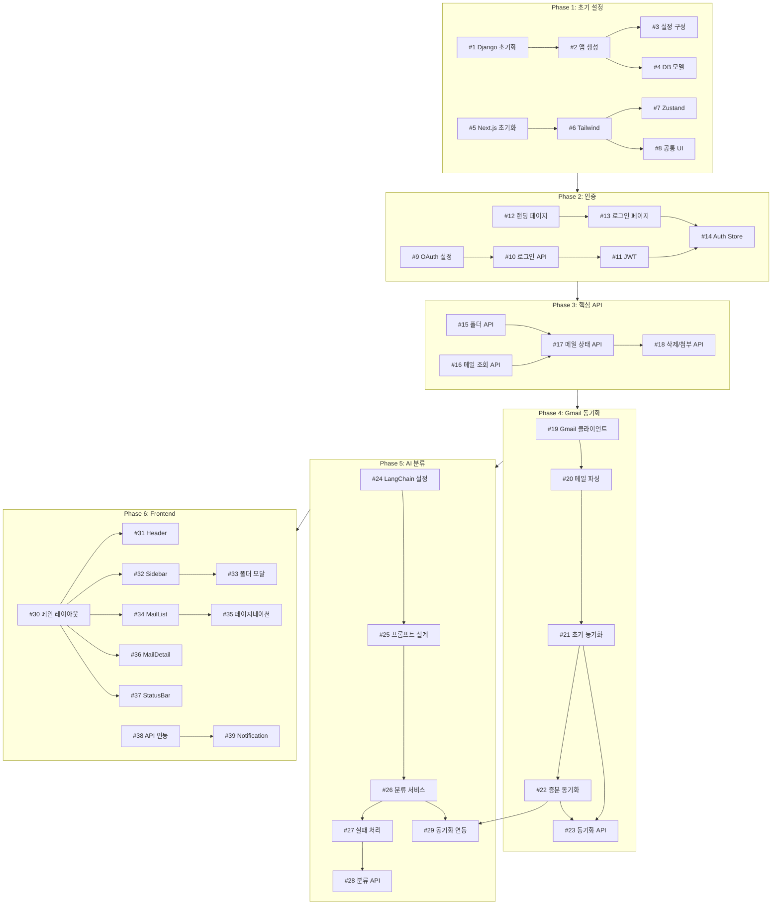

# Pigeon GitHub Issues 계획

> **작성일**: 2025-12-11
> **버전**: v1.0
> **상태**: Draft - 유동적으로 수정 가능

---

## 개요

이 문서는 Pigeon 프로젝트의 GitHub Issue 계획입니다.
Phase별로 구분하여 이슈를 정리하며, 개발 진행 상황에 따라 유동적으로 수정될 수 있습니다.

### 라벨 정의

| 라벨 | 색상 | 설명 |
|------|------|------|
| `setup` | 🟣 | 프로젝트 초기 설정 |
| `backend` | 🔵 | Django 백엔드 |
| `frontend` | 🟢 | Next.js 프론트엔드 |
| `ai` | 🟡 | AI/LLM 관련 |
| `auth` | 🔴 | 인증 관련 |
| `api` | 🟠 | API 개발 |
| `ui` | 🩵 | UI 컴포넌트 |
| `sync` | 🩷 | Gmail 동기화 |
| `deploy` | ⚫ | 배포 관련 |
| `test` | 🟤 | 테스트 |
| `bug` | 🔴 | 버그 수정 |
| `enhancement` | 🔵 | 기능 개선 |
| `priority:high` | 🔴 | 높은 우선순위 |
| `priority:medium` | 🟡 | 중간 우선순위 |
| `priority:low` | 🟢 | 낮은 우선순위 |

---

## Phase 1: 프로젝트 초기 설정

### Issue #1: [BE] Django 프로젝트 초기화

**Labels**: `setup`, `backend`, `priority:high`

**Description**:
Django 프로젝트를 초기화하고 기본 구조를 설정합니다.

**Tasks**:
- [ ] Django 프로젝트 생성 (`pigeon-backend`)
- [ ] uv를 사용한 의존성 관리 설정
- [ ] settings 분리 (base, development, production)
- [ ] `.env` 환경변수 설정
- [ ] `.gitignore` 설정

**참조 문서**: `ARCHITECTURE.md` - 4.1 Django 앱 구조

---

### Issue #2: [BE] Django 앱 생성

**Labels**: `setup`, `backend`, `priority:high`

**Description**:
필요한 Django 앱들을 생성합니다.

**Tasks**:
- [ ] `accounts` 앱 생성 (사용자 인증)
- [ ] `folders` 앱 생성 (폴더 관리)
- [ ] `mails` 앱 생성 (메일 관리)
- [ ] `sync` 앱 생성 (동기화)
- [ ] `classification` 앱 생성 (AI 분류)

**Depends on**: #1

---

### Issue #3: [BE] Django 기본 설정 구성

**Labels**: `setup`, `backend`, `priority:high`

**Description**:
Django REST Framework, CORS, 기타 필수 설정을 구성합니다.

**Tasks**:
- [ ] Django REST Framework 설정
- [ ] drf-spectacular (Swagger) 설정
- [ ] CORS 설정
- [ ] JWT 설정 (djangorestframework-simplejwt)
- [ ] 기본 URL 라우팅 설정

**Depends on**: #2

---

### Issue #4: [BE] 데이터베이스 모델 정의

**Labels**: `setup`, `backend`, `priority:high`

**Description**:
핵심 데이터베이스 모델을 정의합니다.

**Tasks**:
- [ ] `User` 모델 정의 (OAuth 토큰 필드 포함)
- [ ] `Folder` 모델 정의 (트리 구조)
- [ ] `Mail` 모델 정의
- [ ] `SyncStatus` 모델 정의
- [ ] 마이그레이션 생성 및 적용

**참조 문서**: `DATABASE.md`

**Depends on**: #2

---

### Issue #5: [FE] Next.js 프로젝트 초기화

**Labels**: `setup`, `frontend`, `priority:high`

**Description**:
Next.js 프로젝트를 초기화하고 기본 구조를 설정합니다.

**Tasks**:
- [ ] Next.js 프로젝트 생성 (App Router)
- [ ] TypeScript 설정
- [ ] ESLint, Prettier 설정
- [ ] `.env.local` 환경변수 설정
- [ ] 기본 디렉토리 구조 생성

**참조 문서**: `ARCHITECTURE.md` - 5.1 디렉토리 구조

---

### Issue #6: [FE] Tailwind CSS 및 스타일 설정

**Labels**: `setup`, `frontend`, `priority:high`

**Description**:
Tailwind CSS를 설정하고 전역 스타일을 구성합니다.

**Tasks**:
- [ ] Tailwind CSS 설치 및 설정
- [ ] `tailwind.config.js` 커스터마이징
- [ ] `globals.css` 기본 스타일 작성
- [ ] 다크 모드 변수 설정 (향후 대비)

**Depends on**: #5

---

### Issue #7: [FE] Zustand 상태 관리 구조 설정

**Labels**: `setup`, `frontend`, `priority:high`

**Description**:
Zustand를 사용한 상태 관리 구조를 설정합니다.

**Tasks**:
- [ ] Zustand 설치
- [ ] `authStore.ts` 기본 구조
- [ ] `mailStore.ts` 기본 구조
- [ ] `folderStore.ts` 기본 구조
- [ ] `syncStore.ts` 기본 구조

**참조 문서**: `ARCHITECTURE.md` - 5.3 상태 관리

**Depends on**: #5

---

### Issue #8: [FE] 공통 UI 컴포넌트 생성

**Labels**: `setup`, `frontend`, `ui`, `priority:medium`

**Description**:
재사용 가능한 공통 UI 컴포넌트를 생성합니다.

**Tasks**:
- [ ] `Button` 컴포넌트
- [ ] `Input` 컴포넌트
- [ ] `Modal` 컴포넌트
- [ ] `Toast` 컴포넌트
- [ ] `Skeleton` 컴포넌트 (로딩 상태)
- [ ] `Spinner` 컴포넌트

**Depends on**: #6

---

## Phase 2: 인증 시스템

### Issue #9: [BE] Google OAuth2 설정

**Labels**: `backend`, `auth`, `priority:high`

**Description**:
Google Cloud Console에서 OAuth2 자격 증명을 설정합니다.

**Tasks**:
- [ ] Google Cloud Console 프로젝트 생성
- [ ] OAuth 동의 화면 구성
- [ ] OAuth 2.0 클라이언트 ID 생성
- [ ] Gmail API 활성화
- [ ] 필요한 스코프 설정 (gmail.readonly, gmail.modify)
- [ ] 환경변수에 Client ID/Secret 설정

---

### Issue #10: [BE] OAuth 로그인/콜백 API 구현

**Labels**: `backend`, `auth`, `api`, `priority:high`

**Description**:
Google OAuth2 로그인 및 콜백 처리 API를 구현합니다.

**Tasks**:
- [ ] `GET /api/v1/auth/google/login/` - OAuth URL 생성 및 리다이렉트
- [ ] `GET /api/v1/auth/google/callback/` - 콜백 처리, 토큰 교환
- [ ] Access Token / Refresh Token 저장
- [ ] 사용자 생성 또는 조회 로직

**참조 문서**: `API_SPEC.md` - 인증 API

**Depends on**: #9, #4

---

### Issue #11: [BE] JWT 토큰 발급 및 인증 미들웨어

**Labels**: `backend`, `auth`, `priority:high`

**Description**:
JWT 기반 인증 시스템을 구현합니다.

**Tasks**:
- [ ] JWT 토큰 발급 로직
- [ ] `POST /api/v1/auth/token/refresh/` - 토큰 갱신
- [ ] `POST /api/v1/auth/logout/` - 로그아웃
- [ ] `GET /api/v1/users/me/` - 현재 사용자 정보
- [ ] 인증 미들웨어 구현

**Depends on**: #10

---

### Issue #12: [FE] 랜딩 페이지 구현

**Labels**: `frontend`, `ui`, `priority:high`

**Description**:
서비스 소개 및 Gmail 연동 버튼이 있는 랜딩 페이지를 구현합니다.

**Tasks**:
- [ ] 랜딩 페이지 레이아웃
- [ ] 서비스 소개 문구
- [ ] "Gmail 연동하기" 버튼
- [ ] 반응형 디자인

**참조 문서**: `UI_SPEC.md` - 랜딩 페이지

**Depends on**: #6

---

### Issue #13: [FE] 로그인/콜백 페이지 구현

**Labels**: `frontend`, `auth`, `ui`, `priority:high`

**Description**:
OAuth 로그인 플로우를 처리하는 페이지를 구현합니다.

**Tasks**:
- [ ] `/login` 페이지 (로그인 진행 중 상태)
- [ ] `/callback` 페이지 (OAuth 콜백 처리)
- [ ] 토큰 저장 및 리다이렉트 로직
- [ ] 에러 처리 UI

**Depends on**: #7, #12

---

### Issue #14: [FE] Auth Store 및 인증 미들웨어

**Labels**: `frontend`, `auth`, `priority:high`

**Description**:
인증 상태 관리 및 라우트 보호 미들웨어를 구현합니다.

**Tasks**:
- [ ] `authStore` 구현 (로그인 상태, 사용자 정보)
- [ ] `useAuth` 훅 구현
- [ ] `middleware.ts` - 인증 필요 페이지 보호
- [ ] 토큰 갱신 로직

**Depends on**: #11, #13

---

## Phase 3: 핵심 API 개발

### Issue #15: [BE] 폴더 CRUD API 구현

**Labels**: `backend`, `api`, `priority:high`

**Description**:
폴더 관련 CRUD API를 구현합니다.

**Tasks**:
- [ ] `GET /api/v1/folders/` - 폴더 트리 조회
- [ ] `POST /api/v1/folders/` - 폴더 생성
- [ ] `PATCH /api/v1/folders/{id}/` - 폴더 수정
- [ ] `DELETE /api/v1/folders/{id}/` - 폴더 삭제
- [ ] `PUT /api/v1/folders/reorder/` - 폴더 순서 변경
- [ ] 트리 구조 빌딩 로직

**참조 문서**: `API_SPEC.md` - 폴더 API

**Depends on**: #11

---

### Issue #16: [BE] 메일 목록/상세 API 구현

**Labels**: `backend`, `api`, `priority:high`

**Description**:
메일 조회 관련 API를 구현합니다.

**Tasks**:
- [ ] `GET /api/v1/mails/` - 메일 목록 조회 (페이지네이션, 필터)
- [ ] `GET /api/v1/mails/{id}/` - 메일 상세 조회 (자동 읽음 처리)
- [ ] 폴더별, 읽음 상태별 필터링
- [ ] 정렬 옵션 (날짜, 발신자 등)
- [ ] 페이지네이션 구현

**참조 문서**: `API_SPEC.md` - 메일 API

**Depends on**: #11

---

### Issue #17: [BE] 메일 상태/이동 API 구현

**Labels**: `backend`, `api`, `priority:high`

**Description**:
메일 상태 변경 및 폴더 이동 API를 구현합니다.

**Tasks**:
- [ ] `PATCH /api/v1/mails/{id}/` - 메일 상태 수정 (읽음/별표)
- [ ] `POST /api/v1/mails/{id}/move/` - 메일 폴더 이동
- [ ] `POST /api/v1/mails/bulk-move/` - 메일 일괄 이동
- [ ] `POST /api/v1/mails/bulk-update/` - 메일 일괄 상태 변경

**Depends on**: #16

---

### Issue #18: [BE] 메일 삭제 및 첨부파일 API 구현

**Labels**: `backend`, `api`, `priority:medium`

**Description**:
메일 삭제 및 첨부파일 관련 API를 구현합니다.

**Tasks**:
- [ ] `DELETE /api/v1/mails/{id}/` - 메일 삭제 (Soft Delete)
- [ ] `DELETE /api/v1/mails/bulk-delete/` - 메일 일괄 삭제
- [ ] `GET /api/v1/mails/{id}/attachments/{att_id}/` - 첨부파일 다운로드

**Depends on**: #17

---

## Phase 4: Gmail 동기화

### Issue #19: [BE] Gmail API 클라이언트 구현

**Labels**: `backend`, `sync`, `priority:high`

**Description**:
Gmail API를 호출하는 클라이언트를 구현합니다.

**Tasks**:
- [ ] Gmail API 클라이언트 클래스 생성
- [ ] 토큰 자동 갱신 로직
- [ ] `messages.list` 래퍼
- [ ] `messages.get` 래퍼
- [ ] `messages.trash` 래퍼 (삭제)
- [ ] Rate Limiting 처리

**참조 문서**: `ARCHITECTURE.md` - GmailAPIClient

**Depends on**: #11

---

### Issue #20: [BE] 메일 파싱 유틸리티 구현

**Labels**: `backend`, `sync`, `priority:high`

**Description**:
Gmail API 응답을 파싱하는 유틸리티를 구현합니다.

**Tasks**:
- [ ] 메일 헤더 파싱 (From, Subject, Date 등)
- [ ] 메일 본문 파싱 (HTML/Plain text)
- [ ] 첨부파일 메타데이터 추출
- [ ] Gmail API 응답 → Mail 모델 변환

**Depends on**: #19

---

### Issue #21: [BE] 초기 동기화 로직 구현

**Labels**: `backend`, `sync`, `priority:high`

**Description**:
최초 로그인 시 6개월 메일을 동기화하는 로직을 구현합니다.

**Tasks**:
- [ ] 6개월 기간 필터 쿼리 생성
- [ ] 20개 배치 단위 동기화
- [ ] 동기화 상태 추적 (SyncStatus)
- [ ] 중복 메일 처리
- [ ] 에러 발생 시 재시도 로직

**참조 문서**: `PRODUCT_SPEC.md` - F2: 메일 동기화

**Depends on**: #20

---

### Issue #22: [BE] 증분 동기화 로직 구현

**Labels**: `backend`, `sync`, `priority:high`

**Description**:
새 메일을 감지하여 동기화하는 증분 동기화를 구현합니다.

**Tasks**:
- [ ] Gmail History API 활용
- [ ] historyId 기반 새 메일 감지
- [ ] 3분 주기 백그라운드 폴링
- [ ] 새 메일 실시간 분류 연동

**Depends on**: #21

---

### Issue #23: [BE] 동기화 API 구현

**Labels**: `backend`, `sync`, `api`, `priority:high`

**Description**:
동기화 제어 및 상태 조회 API를 구현합니다.

**Tasks**:
- [ ] `POST /api/v1/sync/start/` - 동기화 시작
- [ ] `GET /api/v1/sync/status/` - 동기화 상태 조회
- [ ] `POST /api/v1/sync/stop/` - 동기화 중단
- [ ] SSE 또는 폴링 방식 실시간 상태 업데이트

**Depends on**: #21, #22

---

## Phase 5: AI 분류 시스템

### Issue #24: [AI] LangChain + Gemini 설정

**Labels**: `backend`, `ai`, `priority:high`

**Description**:
LangChain과 Gemini API를 설정합니다.

**Tasks**:
- [ ] LangChain 설치 및 설정
- [ ] Gemini 2.5 Flash 연동
- [ ] LLM 클라이언트 클래스 생성
- [ ] 에러 핸들링 및 재시도 로직

**참조 문서**: `DECISIONS.md` - ADR-005

**Depends on**: #3

---

### Issue #25: [AI] 분류 프롬프트 설계

**Labels**: `ai`, `priority:high`

**Description**:
메일 분류를 위한 프롬프트를 설계합니다.

**Tasks**:
- [ ] 시스템 프롬프트 작성
- [ ] 메일 정보 포맷 정의 (제목, 발신자, 본문)
- [ ] 기존 폴더 구조 주입 방식
- [ ] 응답 JSON 스키마 정의
- [ ] 프롬프트 테스트 및 튜닝

**Depends on**: #24

---

### Issue #26: [AI] 분류 서비스 구현

**Labels**: `backend`, `ai`, `priority:high`

**Description**:
메일 분류 비즈니스 로직을 구현합니다.

**Tasks**:
- [ ] 단일 메일 분류 로직
- [ ] 배치 메일 분류 로직 (20개 단위)
- [ ] 기존 폴더 매칭 로직
- [ ] 새 폴더 자동 생성 로직
- [ ] 분류 결과 저장

**Depends on**: #25, #15

---

### Issue #27: [AI] 분류 실패 처리 및 재시도

**Labels**: `backend`, `ai`, `priority:high`

**Description**:
분류 실패 시 처리 로직을 구현합니다.

**Tasks**:
- [ ] 1회 재시도 로직
- [ ] 재시도 실패 시 "미분류" 폴더 이동
- [ ] 분류 실패 로그 기록
- [ ] 수동 재분류 API

**Depends on**: #26

---

### Issue #28: [BE] 분류 API 구현

**Labels**: `backend`, `ai`, `api`, `priority:high`

**Description**:
분류 관련 API를 구현합니다.

**Tasks**:
- [ ] `POST /api/v1/classification/classify/` - 분류 요청
- [ ] `GET /api/v1/classification/{id}/` - 분류 결과 조회
- [ ] `POST /api/v1/classification/classify-unclassified/` - 미분류 일괄 분류

**Depends on**: #27

---

### Issue #29: [AI] 동기화-분류 연동

**Labels**: `backend`, `ai`, `sync`, `priority:high`

**Description**:
동기화와 분류를 자동으로 연동합니다.

**Tasks**:
- [ ] 초기 동기화 시 자동 분류 트리거
- [ ] 증분 동기화 시 새 메일 실시간 분류
- [ ] 분류 진행 상태 동기화 상태에 포함

**Depends on**: #22, #26

---

## Phase 6: Frontend 개발

### Issue #30: [FE] 메인 레이아웃 구현

**Labels**: `frontend`, `ui`, `priority:high`

**Description**:
3단 레이아웃 (사이드바 | 메일 목록 | 상세)을 구현합니다.

**Tasks**:
- [ ] 3단 레이아웃 컴포넌트
- [ ] 반응형 대응
- [ ] 각 영역 리사이즈 가능 (선택)

**참조 문서**: `UI_SPEC.md` - 메인 레이아웃

**Depends on**: #14

---

### Issue #31: [FE] Header 컴포넌트 구현

**Labels**: `frontend`, `ui`, `priority:high`

**Description**:
상단 헤더 컴포넌트를 구현합니다.

**Tasks**:
- [ ] 로고
- [ ] 사용자 이메일 표시
- [ ] 동기화 버튼
- [ ] 설정/로그아웃 버튼

**Depends on**: #30

---

### Issue #32: [FE] Sidebar (폴더 트리) 구현

**Labels**: `frontend`, `ui`, `priority:high`

**Description**:
좌측 사이드바 폴더 트리를 구현합니다.

**Tasks**:
- [ ] `Sidebar` 컴포넌트
- [ ] `VirtualFolders` (전체/안읽음/별표/미분류)
- [ ] `FolderTree` 재귀 컴포넌트
- [ ] `FolderTreeItem` 컴포넌트
- [ ] 폴더 접기/펼치기
- [ ] 미읽음 카운트 표시

**참조 문서**: `UI_SPEC.md` - 폴더 트리

**Depends on**: #30

---

### Issue #33: [FE] 폴더 컨텍스트 메뉴 및 모달

**Labels**: `frontend`, `ui`, `priority:medium`

**Description**:
폴더 관련 컨텍스트 메뉴와 모달을 구현합니다.

**Tasks**:
- [ ] `FolderContextMenu` (우클릭 메뉴)
- [ ] `FolderCreateModal` (새 폴더 생성)
- [ ] `FolderMoveModal` (폴더 이동)
- [ ] `FolderRenameModal` (이름 변경)

**Depends on**: #32

---

### Issue #34: [FE] MailList 컴포넌트 구현

**Labels**: `frontend`, `ui`, `priority:high`

**Description**:
메일 목록 컴포넌트를 구현합니다.

**Tasks**:
- [ ] `MailList` 컴포넌트
- [ ] `MailListItem` 컴포넌트
- [ ] 체크박스 선택
- [ ] 미읽음 메일 스타일
- [ ] 별표 표시
- [ ] 날짜 포맷팅

**참조 문서**: `UI_SPEC.md` - 메일 목록

**Depends on**: #30

---

### Issue #35: [FE] MailList 페이지네이션 및 검색

**Labels**: `frontend`, `ui`, `priority:medium`

**Description**:
메일 목록의 페이지네이션과 검색 기능을 구현합니다.

**Tasks**:
- [ ] `MailPagination` 컴포넌트
- [ ] 페이지 이동 로직
- [ ] `SearchInput` 컴포넌트
- [ ] 검색 필터 연동

**Depends on**: #34

---

### Issue #36: [FE] MailDetail 컴포넌트 구현

**Labels**: `frontend`, `ui`, `priority:high`

**Description**:
메일 상세 보기 컴포넌트를 구현합니다.

**Tasks**:
- [ ] `MailDetail` 컴포넌트
- [ ] 메일 헤더 (발신자, 제목, 날짜)
- [ ] 메일 본문 렌더링 (HTML sanitize)
- [ ] AI 분류 정보 표시 (폴더, 이유)
- [ ] `AttachmentList` 컴포넌트
- [ ] `MailActions` (이동/삭제 버튼)

**참조 문서**: `UI_SPEC.md` - 메일 상세

**Depends on**: #30

---

### Issue #37: [FE] StatusBar 및 SyncProgress 구현

**Labels**: `frontend`, `ui`, `sync`, `priority:high`

**Description**:
하단 상태바와 동기화 진행률 표시를 구현합니다.

**Tasks**:
- [ ] `StatusBar` 컴포넌트 (하단 고정)
- [ ] `SyncProgress` 컴포넌트
- [ ] 동기화 진행률 표시
- [ ] 분류 진행률 표시
- [ ] 에러 상태 표시

**참조 문서**: `UI_SPEC.md` - 동기화 상태바

**Depends on**: #30

---

### Issue #38: [FE] Store 및 API 연동

**Labels**: `frontend`, `api`, `priority:high`

**Description**:
Zustand Store와 백엔드 API를 연동합니다.

**Tasks**:
- [ ] `folderStore` API 연동
- [ ] `mailStore` API 연동
- [ ] `syncStore` API 연동
- [ ] API 클라이언트 (fetch wrapper) 구현
- [ ] 에러 핸들링 공통화

**Depends on**: #7, API 완료

---

### Issue #39: [FE] Web Notification 구현

**Labels**: `frontend`, `priority:medium`

**Description**:
새 메일 도착 시 브라우저 알림을 구현합니다.

**Tasks**:
- [ ] `useNotification` 훅
- [ ] 알림 권한 요청 UI
- [ ] 새 메일 알림 발송
- [ ] 알림 클릭 시 해당 메일로 이동

**참조 문서**: `PRODUCT_SPEC.md` - F7: 새 메일 브라우저 알림

**Depends on**: #38

---

## Phase 7: 통합 및 테스트

### Issue #40: [TEST] Backend-Frontend 통합 테스트

**Labels**: `test`, `priority:high`

**Description**:
전체 시스템의 통합 테스트를 진행합니다.

**Tasks**:
- [ ] 로그인 → 메인화면 플로우 테스트
- [ ] 동기화 → 분류 플로우 테스트
- [ ] 폴더 CRUD 테스트
- [ ] 메일 이동/삭제 테스트
- [ ] API 응답 검증

**Depends on**: Phase 6

---

### Issue #41: [TEST] E2E 테스트 작성

**Labels**: `test`, `priority:medium`

**Description**:
Playwright를 사용한 E2E 테스트를 작성합니다.

**Tasks**:
- [ ] Playwright 설정
- [ ] 로그인 시나리오 테스트
- [ ] 메일 조회 시나리오 테스트
- [ ] 폴더 관리 시나리오 테스트
- [ ] 동기화 시나리오 테스트

**참조 문서**: `TEST_SCENARIOS.md`

**Depends on**: #40

---

### Issue #42: [FIX] 버그 수정 및 에러 핸들링 점검

**Labels**: `bug`, `priority:high`

**Description**:
통합 테스트에서 발견된 버그를 수정합니다.

**Tasks**:
- [ ] 에러 케이스 점검
- [ ] 예외 처리 보완
- [ ] 콘솔 에러 제거
- [ ] UX 개선

**Depends on**: #40

---

### Issue #43: [PERF] 성능 최적화

**Labels**: `enhancement`, `priority:medium`

**Description**:
성능 병목을 파악하고 최적화합니다.

**Tasks**:
- [ ] API 응답 시간 측정
- [ ] DB 쿼리 최적화
- [ ] 프론트엔드 렌더링 최적화
- [ ] 메모이제이션 적용

**Depends on**: #40

---

## Phase 8: 배포

### Issue #44: [DEPLOY] Backend Railway 배포

**Labels**: `deploy`, `backend`, `priority:high`

**Description**:
Django 백엔드를 Railway에 배포합니다.

**Tasks**:
- [ ] Railway 프로젝트 생성
- [ ] `Procfile` 또는 `railway.toml` 작성
- [ ] 환경변수 설정 (Production)
- [ ] Gunicorn 설정
- [ ] SQLite → 영구 볼륨 설정

**Depends on**: Phase 7

---

### Issue #45: [DEPLOY] Frontend Vercel 배포

**Labels**: `deploy`, `frontend`, `priority:high`

**Description**:
Next.js 프론트엔드를 Vercel에 배포합니다.

**Tasks**:
- [ ] Vercel 프로젝트 연결
- [ ] 환경변수 설정 (Production)
- [ ] 빌드 테스트
- [ ] 도메인 설정 (선택)

**Depends on**: Phase 7

---

### Issue #46: [DEPLOY] 프로덕션 환경 최종 테스트

**Labels**: `deploy`, `test`, `priority:high`

**Description**:
프로덕션 환경에서 전체 플로우를 테스트합니다.

**Tasks**:
- [ ] 프로덕션 URL 접속 확인
- [ ] OAuth 플로우 테스트
- [ ] 동기화/분류 플로우 테스트
- [ ] 에러 모니터링 설정

**Depends on**: #44, #45

---

## 향후 개선사항 (Post-MVP)

### Issue #47: [FEAT] 메일 보내기 기능

**Labels**: `enhancement`, `priority:low`

**Description**:
Gmail을 통해 메일을 발송하는 기능을 구현합니다.

**Tasks**:
- [ ] 메일 작성 UI
- [ ] Gmail send API 연동
- [ ] 발송 완료 알림

---

### Issue #48: [FEAT] 다크 모드

**Labels**: `enhancement`, `ui`, `priority:low`

**Description**:
다크 모드 테마를 구현합니다.

**Tasks**:
- [ ] 테마 토글 UI
- [ ] Tailwind 다크 모드 적용
- [ ] 사용자 선호 저장

---

### Issue #49: [FEAT] 분류 피드백 학습

**Labels**: `enhancement`, `ai`, `priority:low`

**Description**:
사용자 피드백을 기반으로 분류 정확도를 개선합니다.

**Tasks**:
- [ ] 피드백 수집 UI ("잘못 분류됨" 버튼)
- [ ] 피드백 데이터 저장
- [ ] 프롬프트에 피드백 반영

---

## 의존성 그래프

---

*이 문서는 프로젝트 진행 상황에 따라 유동적으로 업데이트됩니다.*
