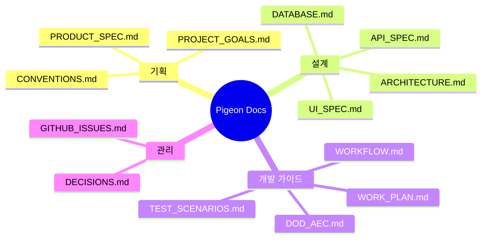
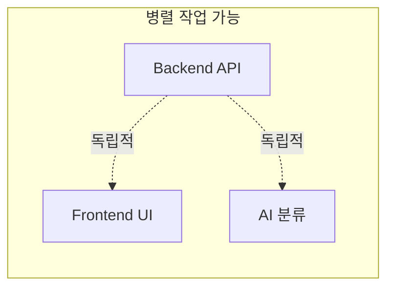
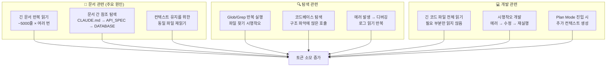
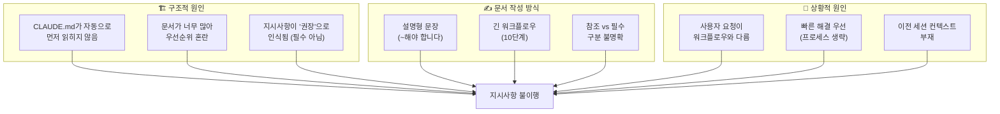

# Pigeon 프로젝트 방법론 리뷰

> **작성일**: 2025-12-15
> **목적**: AI 주도 개발(Claude Code)을 위한 문서 중심 방법론 회고

---

## 1. 개요

Pigeon 프로젝트는 **Claude Code를 활용한 자율 개발**을 실험하기 위해 설계되었습니다. 이를 위해 **문서 주도 개발(Documentation-Driven Development)** 방식을 채택하여, AI가 문서만 보고 스스로 판단하며 개발할 수 있도록 체계적인 문서 시스템을 구축했습니다.

### 1.1 작성된 문서 목록 (13개)



---

## 2. 방법론 핵심 요소

### 2.1 DoD/AEC 기반 완료 기준 명확화

**Definition of Done (DoD)**: 모든 Story에 공통 적용되는 완료 조건
**Acceptance Criteria (AEC)**: 개별 Story가 충족해야 할 구체적 조건

```markdown
# 예시: Story 3.1 폴더 CRUD API

## DoD (전역 완료 기준)
- [ ] 린트 에러 없음
- [ ] 타입 에러 없음
- [ ] API_SPEC.md 형식 준수

## AEC (인수 조건)
- [ ] GET /api/v1/folders/ 호출 시 트리 구조 반환
- [ ] POST /api/v1/folders/ 호출 시 새 폴더 생성
- [ ] 최대 5단계 깊이 제한
```

### 2.2 Phase별 작업 계획 및 의존성 그래프

8개 Phase로 개발 순서를 정의하고, 각 작업 간 의존성을 명시하여 병렬 작업 가능 여부를 판단할 수 있게 했습니다.

```
Phase 1 (초기 설정) → Phase 2 (인증) → Phase 3 (핵심 API)
    → Phase 4 (Gmail 동기화) → Phase 5 (AI 분류)
    → Phase 6 (Frontend) → Phase 7 (통합/테스트) → Phase 8 (배포)
```

### 2.3 ADR (Architecture Decision Records)

23개의 기술 결정 사항을 ADR 형식으로 기록하여, 모든 결정의 맥락/대안/이유를 명문화했습니다.

```markdown
### ADR-004: Database
**결정**: SQLite3
**대안**: PostgreSQL, MySQL
**이유**: MVP에 설정 불필요, 파일 기반으로 간편
```

### 2.4 표준 워크플로우 정의

이슈 생성 → 브랜치 → 설계 문서 참조 → 코드 작성 → 테스트 → 커밋 → PR의 전체 흐름을 문서화했습니다.

---

## 3. 좋았던 점

### 3.1 자율 개발 가능

| 장점 | 설명 |
|------|------|
| **명확한 완료 기준** | AEC 체크리스트로 "완료"를 객관적으로 판단 가능 |
| **참조 문서 명시** | 각 작업에 어떤 문서를 참조해야 하는지 명확 |
| **의존성 그래프** | 어떤 순서로 작업해야 하는지 시각적 파악 |

**효과**: Claude Code가 질문 없이 독립적으로 작업 진행 가능

### 3.2 일관성 유지

| 장점 | 설명 |
|------|------|
| **기술 결정 기록** | 왜 Django인지, 왜 SQLite인지 모든 결정 근거 존재 |
| **컨벤션 문서화** | 브랜치 네이밍, 커밋 메시지 형식 통일 |
| **API 응답 형식 표준화** | 성공/에러 응답 구조 일관성 |

**효과**: 여러 세션에 걸쳐 작업해도 스타일 일관성 유지

### 3.3 병렬 작업 효율성



| 장점 | 설명 |
|------|------|
| **Squad 역할 분담** | BE/FE/AI Agent로 역할 구분 |
| **병렬 가능 명시** | 어떤 작업이 동시 진행 가능한지 표시 |
| **체크포인트 정의** | Phase 완료 후 동기화 시점 명시 |

### 3.4 지식 보존 및 온보딩

| 장점 | 설명 |
|------|------|
| **맥락 유지** | 새 세션에서도 프로젝트 이해 가능 |
| **결정 배경 기록** | "왜?"에 대한 답이 항상 존재 |
| **학습 자료** | 문서 자체가 프로젝트 학습 교재 |

---

## 4. 문제점 및 개선점

### 4.1 과도한 초기 문서 작성 시간

| 문제 | 영향 |
|------|------|
| 13개 문서 작성에 상당한 시간 소요 | 실제 개발 시작 지연 |
| 완벽주의적 문서화 경향 | 오버 엔지니어링 위험 |
| 문서 간 중복 내용 | 유지보수 부담 증가 |

**개선 방안**:
- **MVP 문서 세트 정의**: 필수 5개 (ARCHITECTURE, API_SPEC, DATABASE, DOD_AEC, WORKFLOW)
- **점진적 문서화**: 개발하면서 필요한 부분만 상세화
- **템플릿 활용**: 반복 문서는 템플릿으로 빠르게 생성

### 4.2 문서-코드 동기화 어려움

| 문제 | 영향 |
|------|------|
| 개발 중 설계 변경 시 문서 수정 필요 | 추가 작업 부담 |
| 문서 업데이트 누락 시 | 정보 불일치로 혼란 |
| API 변경 시 API_SPEC.md 수동 수정 | 실수 가능성 |

**개선 방안**:
- **Swagger 자동 생성**: drf-spectacular로 API 문서 자동화
- **코드 우선 접근**: 간단한 변경은 코드 주석으로 대체
- **문서 검토 체크포인트**: PR 시 관련 문서 업데이트 확인

### 4.3 유연성 감소

| 문제 | 영향 |
|------|------|
| 상세한 사전 설계 | 변경 시 문서 수정 비용 |
| 엄격한 Phase 순서 | 빠른 프로토타이핑 어려움 |
| AEC 체크리스트 | 창의적 해결책 제한 가능 |

**개선 방안**:
- **핵심 vs 세부 구분**: 핵심 결정만 고정, 세부사항은 유연하게
- **실험 Phase 허용**: 탐색적 개발 시간 별도 배정
- **AEC 수정 허용**: 합리적 이유 있으면 인수 조건 변경 가능

### 4.4 Claude Code 특화 문제

| 문제 | 영향 |
|------|------|
| 컨텍스트 길이 제한 | 모든 문서를 한번에 참조 불가 |
| 문서 해석 오류 가능 | 의도와 다른 구현 |
| CLAUDE.md 유지보수 | 프로젝트별 지시사항 관리 필요 |

**개선 방안**:
- **계층적 문서 구조**: CLAUDE.md에서 필요한 문서만 참조하도록 안내
- **명확한 우선순위**: 충돌 시 어떤 문서를 따를지 명시
- **예시 코드 포함**: 추상적 설명보다 구체적 코드 예시 제공

### 4.5 토큰 소모량 과다 문제 ⚠️

프로젝트 진행 중 **예상보다 훨씬 많은 토큰이 소모**되었습니다.

#### 원인 분석



#### 세부 원인별 분석

| 원인 | 설명 | 토큰 영향 |
|------|------|----------|
| **문서 길이** | 13개 문서, 총 ~5000줄 | 매 참조 시 수천 토큰 |
| **반복 읽기** | 같은 문서를 여러 번 읽음 (세션 내 컨텍스트 밀림) | 누적 증가 |
| **탐색적 검색** | 파일 위치/내용 찾기 위한 Glob/Grep 반복 | 검색당 수백 토큰 |
| **전체 파일 읽기** | 일부만 필요해도 전체 파일 Read | 대형 파일 시 낭비 |
| **Plan Mode** | 계획 수립 시 추가 컨텍스트 생성 | 계획당 수천 토큰 |
| **에러 루프** | 실패 → 수정 → 재시도 반복 | 시도당 누적 |
| **Agent 생성** | Task 도구로 서브에이전트 생성 시 | 에이전트당 별도 컨텍스트 |

#### 토큰 소모 패턴 예시

```
┌────────────────────────────────────────────────────────────┐
│ 일반적인 기능 구현 세션의 토큰 흐름                           │
├────────────────────────────────────────────────────────────┤
│                                                            │
│ 1. CLAUDE.md 읽기           ████░░░░░░░░░░░░ (~2K)        │
│ 2. DOD_AEC.md 읽기          ████████░░░░░░░░ (~5K)        │
│ 3. API_SPEC.md 읽기         ████████████░░░░ (~8K)        │
│ 4. 기존 코드 탐색           ████████████████ (~12K)       │
│ 5. 코드 작성/수정           █████████████████░ (~15K)     │
│ 6. 에러 수정 반복           ██████████████████████ (~20K) │
│ 7. 테스트/확인              ████████████████████████(~25K)│
│                                                            │
│ → 단일 기능에 20K-30K 토큰 소모                            │
└────────────────────────────────────────────────────────────┘
```

#### 개선 방안

| 방안 | 설명 | 효과 |
|------|------|------|
| **문서 간소화** | 핵심 내용만 남기고 상세 내용은 별도 참조 | 읽기 토큰 50%↓ |
| **CLAUDE.md 최적화** | 필수 정보만 포함, 나머지는 "필요 시 참조" | 초기 로딩↓ |
| **파일 부분 읽기** | `offset`, `limit` 파라미터 적극 활용 | 대형 파일↓ |
| **캐시 활용** | 자주 참조하는 정보는 세션 초반에 정리 | 반복 읽기↓ |
| **명확한 지시** | 탐색 범위를 명시적으로 제한 | 불필요 검색↓ |
| **증분 개발** | 작은 단위로 나눠서 작업 | 에러 루프↓ |

### 4.6 새 세션에서 지시사항 불이행 문제 ⚠️

매 기능별로 새 세션을 만들어 작업했을 때, **문서화된 워크플로우가 지켜지지 않는 경우**가 빈번했습니다.

#### 발생한 문제들

| 문제 | 빈도 | 영향 |
|------|------|------|
| **문서 미참조 후 개발** | 자주 | 설계와 다른 구현 |
| **이슈 미생성** | 자주 | 작업 추적 불가 |
| **브랜치 미생성** | 자주 | main에 직접 커밋 위험 |
| **Plan Mode 자의적 진입** | 가끔 | 불필요한 계획 수립 시간 |
| **AEC 미확인** | 가끔 | 불완전한 구현 |

#### 원인 분석



#### 세부 원인

1. **CLAUDE.md 자동 로딩 문제**
   - 새 세션 시작 시 CLAUDE.md를 자동으로 읽지 않을 수 있음
   - 사용자 요청에 바로 응답하려는 경향

2. **지시사항 작성 방식**
   ```markdown
   # 나쁜 예 (설명형, 선택적으로 느껴짐)
   작업 시작 전 DOD_AEC.md를 참조하는 것이 좋습니다.

   # 좋은 예 (명령형, 필수로 느껴짐)
   ⚠️ 필수: 코드 작성 전 반드시 다음을 수행하세요:
   1. gh issue create로 이슈 생성
   2. git checkout -b feature/xxx-#이슈번호
   3. DOD_AEC.md에서 해당 Story의 AEC 확인
   ```

3. **워크플로우 길이**
   - 10단계 워크플로우 → 핵심 단계 놓침
   - 모든 단계가 동등하게 보임 (우선순위 없음)

4. **사용자 요청과 충돌**
   ```
   사용자: "폴더 API 만들어줘"

   워크플로우 기대: 이슈 생성 → 브랜치 → 문서 참조 → 개발
   실제 행동: 바로 코드 작성 시작
   ```

#### 개선 방안

| 방안 | 구현 방법 | 효과 |
|------|----------|------|
| **강제 체크리스트** | CLAUDE.md 상단에 "코드 작성 전 필수 단계" 명시 | 누락 방지 |
| **명령형 문장** | "~해야 합니다" → "반드시 ~하세요" | 준수율↑ |
| **단축 워크플로우** | 10단계 → 5단계 핵심만 | 기억 용이 |
| **세션 시작 프롬프트** | 사용자가 매 세션 시작 시 워크플로우 상기 | 컨텍스트 유지 |
| **자동화 스크립트** | 이슈/브랜치 생성 명령어 제공 | 프로세스 강제 |

#### 권장 CLAUDE.md 구조

```markdown
# 프로젝트명

## ⚠️ 필수 워크플로우 (코드 작성 전 반드시 수행)

### 1. 이슈 생성 (생략 불가)
```bash
gh issue create --title "feat(scope): 기능명" --label "BE"
```

### 2. 브랜치 생성 (생략 불가)
```bash
git checkout -b feature/기능명-#이슈번호
```

### 3. AEC 확인 (생략 불가)
- DOD_AEC.md에서 해당 Story 찾아 인수 조건 확인
- 체크리스트를 TODO에 복사

### 4. 이후 개발 진행
...

---

## 참조 문서 (필요 시)
- API_SPEC.md: API 구현 시
- DATABASE.md: 모델 수정 시
...
```

---

## 5. 정량적 분석

### 5.1 문서 규모

| 문서 | 줄 수 | 주요 내용 |
|------|-------|----------|
| DOD_AEC.md | 738줄 | 8 Phase, 24 Story의 완료 기준 |
| ARCHITECTURE.md | 832줄 | 시스템 구조, 디자인 패턴 |
| API_SPEC.md | ~1000줄 | 모든 API 엔드포인트 명세 |
| DECISIONS.md | 740줄 | 23개 기술 결정 기록 |
| WORK_PLAN.md | 687줄 | 작업 계획 및 의존성 |
| WORKFLOW.md | 475줄 | 표준 개발 워크플로우 |
| **총계** | **~5000줄** | 13개 문서 |

### 5.2 문서 작성 vs 개발 비율 (예상)

```
┌─────────────────────────────────────────────┐
│           프로젝트 시간 분배 (예상)            │
├─────────────────────────────────────────────┤
│ ████████░░░░░░░░░░░░ 문서 작성 (40%)        │
│ ████████████░░░░░░░░ 개발 (50%)             │
│ ██░░░░░░░░░░░░░░░░░░ 테스트/배포 (10%)       │
└─────────────────────────────────────────────┘
```

---

## 6. 핵심 교훈

### 6.1 Do's (권장)

| 항목 | 이유 |
|------|------|
| **DoD/AEC 정의** | 완료 기준이 명확해야 자율 개발 가능 |
| **ADR 작성** | 기술 결정 근거가 있어야 일관성 유지 |
| **CLAUDE.md 활용** | 프로젝트별 컨텍스트 전달에 효과적 |
| **Phase별 작업 계획** | 순서와 의존성 파악에 필수 |
| **Mermaid 다이어그램** | 시각적 이해도 향상 |

### 6.2 Don'ts (주의)

| 항목 | 이유 |
|------|------|
| **모든 것을 문서화** | 시간 낭비, 개발 지연 |
| **문서 완벽주의** | MVP에는 불필요 |
| **문서 간 중복** | 동기화 실패 위험 |
| **너무 상세한 UI 명세** | 개발 중 자주 변경됨 |
| **경직된 Phase 순서** | 탐색적 개발 방해 |

---

## 7. 권장 문서 세트

### 7.1 최소 필수 문서 (MVP)

```
📁 docs/
├── CLAUDE.md          # Claude Code 지시사항 (필수)
├── ARCHITECTURE.md    # 시스템 구조 (필수)
├── API_SPEC.md        # API 명세 (BE 작업 시)
├── DATABASE.md        # DB 설계 (BE 작업 시)
├── DOD_AEC.md         # 완료 기준 (필수)
└── DECISIONS.md       # 기술 결정 (필수)
```

### 7.2 선택적 문서 (필요 시)

```
📁 docs/
├── UI_SPEC.md         # 복잡한 UI 시
├── WORK_PLAN.md       # 다중 에이전트/병렬 작업 시
├── WORKFLOW.md        # 팀 협업 시
├── TEST_SCENARIOS.md  # QA 단계
└── CONVENTIONS.md     # 팀 규모가 클 때
```

---

## 8. 결론

### 8.1 방법론 평가

| 평가 항목 | 점수 | 코멘트 |
|----------|------|--------|
| **자율 개발 지원** | ⭐⭐⭐⭐⭐ | DoD/AEC로 완료 판단 가능 |
| **일관성 유지** | ⭐⭐⭐⭐⭐ | ADR, 컨벤션으로 스타일 통일 |
| **개발 속도** | ⭐⭐⭐☆☆ | 초기 문서 작성 시간 소요 |
| **유연성** | ⭐⭐⭐☆☆ | 변경 시 문서 수정 필요 |
| **유지보수성** | ⭐⭐⭐⭐☆ | 문서-코드 동기화 주의 필요 |

### 8.2 최종 권장사항

1. **문서 주도 개발은 AI 자율 개발에 효과적**
   - 명확한 완료 기준과 참조 문서가 핵심

2. **적정 수준의 문서화가 중요**
   - 과도한 문서화는 역효과
   - MVP 문서 세트로 시작, 점진적 확장

3. **문서 자동화 적극 활용**
   - Swagger, TypeDoc 등으로 코드-문서 동기화

4. **CLAUDE.md를 허브로 활용**
   - 핵심 정보와 문서 참조 경로 집중
   - 프로젝트별 컨텍스트 효과적 전달

---

## 부록: 체크리스트

### A. 새 프로젝트 시작 시

- [ ] CLAUDE.md 작성 (프로젝트 개요, 기술 스택, 참조 문서)
- [ ] DECISIONS.md 작성 (핵심 기술 결정 3-5개)
- [ ] ARCHITECTURE.md 작성 (시스템 구조, 디렉토리)
- [ ] DOD_AEC.md 작성 (Phase별 완료 기준)
- [ ] API_SPEC.md 작성 (필요 시)

### B. 개발 중

- [ ] 문서 변경 시 관련 문서 모두 업데이트
- [ ] PR에 문서 수정 포함 여부 확인
- [ ] AEC 달성 여부 체크리스트로 확인

### C. 프로젝트 완료 후

- [ ] 실제 구현과 문서 일치 여부 검토
- [ ] 변경된 결정사항 DECISIONS.md 업데이트
- [ ] 회고 및 방법론 개선점 기록

---

*이 문서는 Pigeon 프로젝트 경험을 바탕으로 작성되었습니다.*
