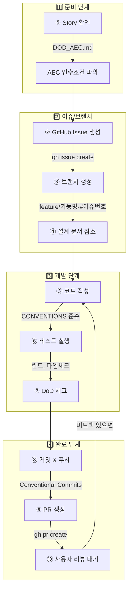

# Claude Code 작업 워크플로우

> **작성일**: 2025-12-11
> **버전**: v1.0
> **목적**: Claude Code가 자율적으로 개발 작업을 수행할 때 따라야 할 표준 워크플로우

---

## 1. 개요

이 문서는 Claude Code가 Story/Task를 할당받았을 때 **이슈 생성부터 PR 생성까지** 따라야 할 구체적인 작업 흐름을 정의합니다.

### 1.1 레포지토리 구조

| 레포지토리 | 용도 | 기술 스택 |
|------------|------|-----------|
| `pigeon-backend` | 백엔드 API 서버 | Django, DRF, SQLite3 |
| `pigeon-frontend` | 프론트엔드 웹앱 | Next.js, TypeScript, Tailwind |
| `pigeon-docs` | 프로젝트 문서 | Markdown |

### 1.2 참조 문서 위치

모든 설계 문서는 `pigeon-docs/docs/` 에 위치:
- `DOD_AEC.md` - 완료 기준, 인수 조건
- `API_SPEC.md` - API 명세
- `DATABASE.md` - DB 스키마
- `UI_SPEC.md` - UI/UX 설계
- `CONVENTIONS.md` - 코드 컨벤션
- `ARCHITECTURE.md` - 시스템 아키텍처
- `WORK_PLAN.md` - 작업 계획

---

## 2. 표준 작업 워크플로우



---

## 3. 단계별 상세 가이드

### 3.1 Step ①: Story 확인

**목적**: 작업 범위와 완료 조건 파악

```bash
# docs 레포에서 DOD_AEC.md 확인
cat pigeon-docs/docs/DOD_AEC.md
```

**확인 사항**:
- [ ] Story 설명 이해
- [ ] AEC (인수 조건) 체크리스트 확인
- [ ] Tasks 목록 확인
- [ ] 의존성 확인 (선행 작업 완료 여부)

---

### 3.2 Step ②: GitHub Issue 생성

**목적**: 작업 추적을 위한 이슈 생성

```bash
# 해당 레포로 이동
cd pigeon-backend  # 또는 pigeon-frontend

# 이슈 생성
gh issue create \
  --title "feat(folder): 폴더 CRUD API 구현" \
  --body "$(cat <<'EOF'
## 설명
폴더 생성, 조회, 수정, 삭제 API를 구현합니다.

## AEC (인수 조건)
- [ ] GET /api/v1/folders/ 호출 시 트리 구조로 폴더 목록 반환
- [ ] POST /api/v1/folders/ 호출 시 새 폴더 생성
- [ ] 최대 5단계 깊이 제한
- [ ] PATCH /api/v1/folders/{id}/ 호출 시 폴더 수정
- [ ] DELETE /api/v1/folders/{id}/ 호출 시 폴더 삭제

## Tasks
- [ ] FolderSerializer 구현
- [ ] FolderViewSet 구현
- [ ] TreeManagerService 구현

## 참고 문서
- [API_SPEC.md](../pigeon-docs/docs/API_SPEC.md)
- [DATABASE.md](../pigeon-docs/docs/DATABASE.md)
EOF
)" \
  --label "phase-3,BE,epic:folder"
```

**Labels 규칙**:
- Phase: `phase-1` ~ `phase-8`
- 담당: `BE`, `FE`, `AI`
- Epic: `epic:auth`, `epic:folder`, `epic:mail`, `epic:sync`, `epic:classify`, `epic:ui`
- 우선순위: `priority:critical`, `priority:high`, `priority:medium`

---

### 3.3 Step ③: 브랜치 생성

**목적**: 작업용 브랜치 생성

```bash
# 최신 main 브랜치로 이동
git checkout main
git pull origin main

# 브랜치 생성 (이슈 번호 포함)
git checkout -b feature/folder-crud-#42
```

**브랜치 네이밍 규칙** ([CONVENTIONS.md](./CONVENTIONS.md) 참조):

| 유형 | 패턴 | 예시 |
|------|------|------|
| 기능 | `feature/{기능명}-#{이슈번호}` | `feature/folder-crud-#42` |
| 버그 | `fix/{버그명}-#{이슈번호}` | `fix/tree-render-#58` |
| 문서 | `docs/{문서명}-#{이슈번호}` | `docs/api-spec-#10` |

---

### 3.4 Step ④: 설계 문서 참조

**목적**: 구현에 필요한 스펙 확인

**Backend 작업 시**:
```bash
# API 명세 확인
cat pigeon-docs/docs/API_SPEC.md

# DB 스키마 확인
cat pigeon-docs/docs/DATABASE.md

# 아키텍처 확인
cat pigeon-docs/docs/ARCHITECTURE.md
```

**Frontend 작업 시**:
```bash
# UI 설계 확인
cat pigeon-docs/docs/UI_SPEC.md

# API 명세 확인 (연동할 API)
cat pigeon-docs/docs/API_SPEC.md
```

---

### 3.5 Step ⑤: 코드 작성

**목적**: AEC를 충족하는 코드 구현

**Backend (Django) 체크리스트**:
- [ ] 파일명: snake_case (`folder_service.py`)
- [ ] PEP 8 준수
- [ ] 타입 힌트 사용
- [ ] Serializer, ViewSet, Service 분리
- [ ] 에러 핸들링 포함

**Frontend (Next.js) 체크리스트**:
- [ ] 파일명: camelCase/PascalCase (`FolderTree.tsx`)
- [ ] TypeScript 타입 정의
- [ ] 함수형 컴포넌트 + Hooks
- [ ] 로딩/에러 상태 처리

---

### 3.6 Step ⑥: 테스트 실행

**목적**: 코드 품질 및 기능 검증

**Backend**:
```bash
cd pigeon-backend

# 린트 체크
ruff check .

# 타입 체크 (선택)
mypy .

# 단위 테스트
pytest

# 서버 실행 후 수동 테스트
python manage.py runserver
# Swagger UI에서 API 테스트: http://localhost:8000/api/v1/docs/
```

**Frontend**:
```bash
cd pigeon-frontend

# 린트 체크
npm run lint

# 타입 체크
npm run type-check  # 또는 tsc --noEmit

# 단위 테스트 (있는 경우)
npm test

# 개발 서버 실행 후 수동 테스트
npm run dev
# 브라우저에서 확인: http://localhost:3000
```

---

### 3.7 Step ⑦: DoD 체크

**목적**: 전역 완료 기준 충족 확인

**DoD 체크리스트** ([DOD_AEC.md](./DOD_AEC.md) 참조):

```markdown
## 코드 품질
- [ ] 린트 에러 없음
- [ ] 타입 에러 없음
- [ ] 콘솔 에러/경고 없음
- [ ] 하드코딩된 비밀값 없음

## 컨벤션 준수
- [ ] 브랜치명 규칙 준수
- [ ] 파일/디렉토리 네이밍 규칙 준수
- [ ] 코드 스타일 준수

## 기능 동작
- [ ] 해당 기능 정상 동작
- [ ] 에러 케이스 처리
- [ ] 로딩 상태 표시 (UI)

## API 규약 (Backend)
- [ ] API_SPEC.md 형식 준수
- [ ] 적절한 HTTP 상태 코드
- [ ] Swagger 문서 생성됨
```

---

### 3.8 Step ⑧: 커밋 & 푸시

**목적**: 변경사항 저장 및 원격 저장소 반영

```bash
# 변경사항 확인
git status
git diff

# 스테이징
git add .

# 커밋 (Conventional Commits 형식)
git commit -m "$(cat <<'EOF'
feat(folder): 폴더 CRUD API 구현

- FolderSerializer 구현
- FolderViewSet CRUD 구현
- TreeManagerService로 트리 구조 변환
- 최대 깊이 5단계 제한 적용

Closes #42
EOF
)"

# 푸시
git push -u origin feature/folder-crud-#42
```

**커밋 메시지 규칙** ([CONVENTIONS.md](./CONVENTIONS.md) 참조):

```
<type>(<scope>): <subject>

<body>

<github-issue>
```

| Type | 설명 |
|------|------|
| `feat` | 새로운 기능 |
| `fix` | 버그 수정 |
| `docs` | 문서 변경 |
| `refactor` | 리팩토링 |
| `test` | 테스트 추가 |
| `chore` | 빌드, 설정 등 |

---

### 3.9 Step ⑨: PR 생성

**목적**: 코드 리뷰 요청

```bash
gh pr create \
  --title "feat(folder): 폴더 CRUD API 구현" \
  --body "$(cat <<'EOF'
## Summary
- 폴더 생성, 조회, 수정, 삭제 API 구현
- 트리 구조 조회 지원
- 최대 5단계 깊이 제한

## Changes
- `folders/serializers.py`: FolderSerializer 추가
- `folders/views.py`: FolderViewSet 추가
- `folders/services/tree_manager.py`: TreeManagerService 추가

## AEC 체크리스트
- [x] GET /api/v1/folders/ 트리 구조 반환
- [x] POST /api/v1/folders/ 폴더 생성
- [x] 최대 5단계 깊이 제한
- [x] PATCH /api/v1/folders/{id}/ 폴더 수정
- [x] DELETE /api/v1/folders/{id}/ 폴더 삭제

## DoD 체크리스트
- [x] 린트 에러 없음
- [x] 타입 에러 없음
- [x] 기능 정상 동작
- [x] API_SPEC.md 형식 준수

## Test Plan
- [x] Swagger UI에서 각 API 테스트 완료
- [x] 트리 구조 정상 반환 확인
- [x] 깊이 제한 에러 확인

Closes #42
EOF
)" \
  --base main
```

---

### 3.10 Step ⑩: 리뷰 대기 및 수정

**목적**: 피드백 반영

```bash
# PR 상태 확인
gh pr status

# 리뷰 코멘트 확인
gh pr view --comments

# 피드백 반영 후 재푸시
git add .
git commit -m "fix(folder): 리뷰 피드백 반영

- 에러 메시지 개선
- 유효성 검증 추가

Refs #42"
git push
```

---

## 4. 상황별 워크플로우

### 4.1 버그 수정

```bash
# 1. 이슈 생성
gh issue create --title "fix(ui): 폴더 트리 렌더링 오류" --label "fix,FE"

# 2. 브랜치 생성
git checkout -b fix/folder-tree-render-#58

# 3. 버그 수정 및 테스트

# 4. 커밋
git commit -m "fix(ui): 폴더 트리 렌더링 오류 수정

깊이 3 이상 폴더가 표시되지 않는 문제 해결

Fixes #58"

# 5. PR 생성
gh pr create --title "fix(ui): 폴더 트리 렌더링 오류 수정"
```

### 4.2 여러 Story를 순차 작업

```bash
# Story A 완료 후 PR 생성
git checkout main
git pull origin main

# Story B 시작
git checkout -b feature/story-b-#43
# ... 작업 ...
```

### 4.3 작업 중 main 브랜치 업데이트 반영

```bash
# 현재 브랜치에서
git fetch origin
git rebase origin/main

# 충돌 발생 시 해결 후
git rebase --continue
```

---

## 5. 명령어 요약

### 5.1 GitHub CLI (gh)

| 명령어 | 설명 |
|--------|------|
| `gh issue create` | 이슈 생성 |
| `gh issue list` | 이슈 목록 |
| `gh issue view {번호}` | 이슈 상세 |
| `gh pr create` | PR 생성 |
| `gh pr list` | PR 목록 |
| `gh pr status` | PR 상태 |
| `gh pr view --comments` | PR 코멘트 확인 |

### 5.2 Git

| 명령어 | 설명 |
|--------|------|
| `git checkout -b {브랜치명}` | 브랜치 생성 및 이동 |
| `git add .` | 모든 변경사항 스테이징 |
| `git commit -m "{메시지}"` | 커밋 |
| `git push -u origin {브랜치}` | 푸시 (최초) |
| `git push` | 푸시 (이후) |
| `git rebase origin/main` | main 변경사항 반영 |

---

## 6. 관련 문서

- [DOD_AEC.md](./DOD_AEC.md) - 완료 기준, 인수 조건
- [CONVENTIONS.md](./CONVENTIONS.md) - Git/코드 컨벤션
- [API_SPEC.md](./API_SPEC.md) - API 명세
- [DATABASE.md](./DATABASE.md) - DB 스키마
- [UI_SPEC.md](./UI_SPEC.md) - UI 설계
- [WORK_PLAN.md](./WORK_PLAN.md) - 작업 계획

---

*이 문서는 프로젝트 진행에 따라 지속적으로 업데이트됩니다.*
