# Pigeon 작업 계획서 (Work Plan)

> **작성일**: 2025-12-10
> **버전**: v1.1
> **목적**: Claude Code Squad 병렬 작업 및 자율 개발 가이드

---

## 1. 개요

이 문서는 Pigeon 프로젝트의 개발 작업 순서, 의존성, 병렬 작업 가이드를 정의합니다.
Claude Code가 이 문서를 참조하여 자율적으로 개발을 진행할 수 있습니다.

### 1.1 프로젝트 요약

| 항목 | 내용 |
|------|------|
| 프로젝트명 | Pigeon - AI 메일 폴더링 시스템 |
| Backend | Django + SQLite3 |
| Frontend | Next.js (App Router) + TypeScript |
| LLM | Gemini 2.5 Flash + LangChain |
| 배포 | Frontend: Vercel, Backend: Railway |

---

## 2. 개발 Phase 개요

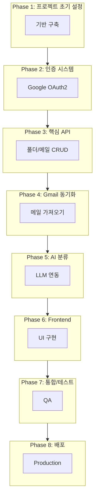

---

## 3. Phase별 상세 작업

### Phase 1: 프로젝트 초기 설정

**목표**: Backend/Frontend 프로젝트 스켈레톤 구축

#### 작업 목록

| # | 작업 | 담당 | 의존성 | 산출물 |
|---|------|------|--------|--------|
| 1.1 | Django 프로젝트 초기화 | BE | 없음 | `backend/` 디렉토리 |
| 1.2 | Django 앱 생성 (accounts, folders, mails, sync, classification) | BE | 1.1 | 앱 디렉토리 |
| 1.3 | Django 설정 구성 (settings, urls, CORS) | BE | 1.1 | 설정 파일 |
| 1.4 | Next.js 프로젝트 초기화 (App Router) | FE | 없음 | `frontend/` 디렉토리 |
| 1.5 | Tailwind CSS 설정 | FE | 1.4 | tailwind.config.js |
| 1.6 | Zustand Store 구조 설정 | FE | 1.4 | stores/ 디렉토리 |
| 1.7 | 공통 UI 컴포넌트 생성 | FE | 1.4, 1.5 | components/ui/ |
| 1.8 | DB 모델 정의 (User, Folder, Mail) | BE | 1.2 | models.py |
| 1.9 | DB 마이그레이션 | BE | 1.8 | migration 파일 |
| 1.10 | drf-spectacular 설정 (Swagger) | BE | 1.3 | API 문서 URL |

#### 병렬 작업 가이드

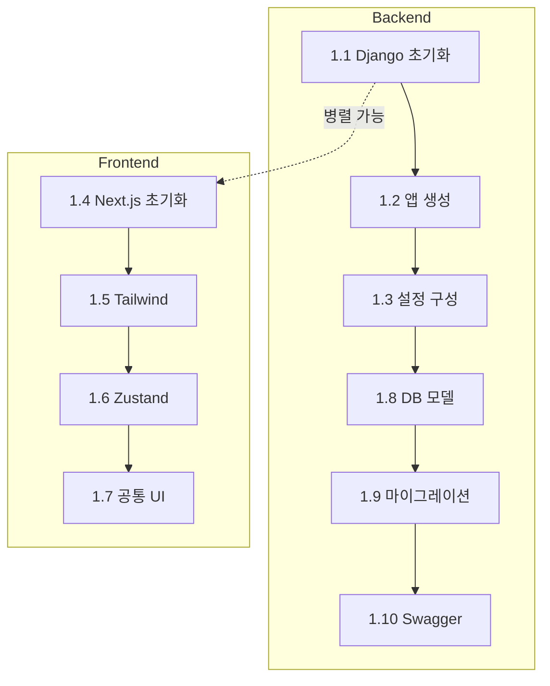

#### 완료 조건

- [ ] `python manage.py runserver` 정상 실행
- [ ] `npm run dev` 정상 실행
- [ ] `/api/v1/docs/` Swagger UI 접속 가능
- [ ] DB 마이그레이션 완료

---

### Phase 2: 인증 시스템

**목표**: Google OAuth2 로그인 구현

#### 작업 목록

| # | 작업 | 담당 | 의존성 | 산출물 |
|---|------|------|--------|--------|
| 2.1 | Google OAuth2 설정 (Client ID/Secret) | BE | Phase 1 | 환경변수 |
| 2.2 | OAuth 로그인 API 구현 | BE | 2.1 | `/auth/google/login/` |
| 2.3 | OAuth 콜백 API 구현 | BE | 2.2 | `/auth/google/callback/` |
| 2.4 | JWT 토큰 발급/검증 | BE | 2.3 | 토큰 유틸리티 |
| 2.5 | 토큰 갱신 API | BE | 2.4 | `/auth/token/refresh/` |
| 2.6 | 로그아웃 API | BE | 2.4 | `/auth/logout/` |
| 2.7 | 사용자 정보 API | BE | 2.4 | `/users/me/` |
| 2.8 | 랜딩 페이지 UI | FE | Phase 1 | `/` |
| 2.9 | 로그인 페이지 UI | FE | 2.8 | `/login` |
| 2.10 | OAuth 콜백 페이지 | FE | 2.9 | `/callback` |
| 2.11 | Auth Store (Zustand) | FE | 2.10 | authStore.ts |
| 2.12 | 인증 미들웨어/가드 | FE | 2.11 | middleware.ts |

#### 병렬 작업 가이드

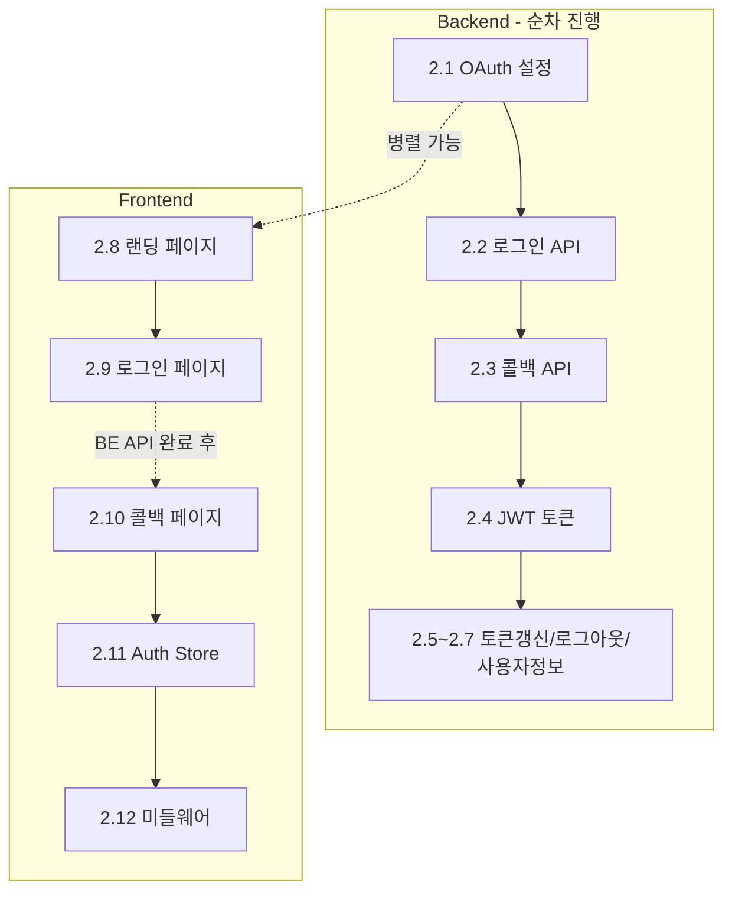

#### 완료 조건

- [ ] Google 로그인 후 JWT 토큰 발급
- [ ] 토큰으로 `/users/me/` API 호출 성공
- [ ] 토큰 갱신 정상 작동
- [ ] 프론트엔드에서 로그인 → 메인화면 진입 가능

---

### Phase 3: 핵심 API 개발

**목표**: 폴더/메일 CRUD API 구현

#### 작업 목록

| # | 작업 | 담당 | 의존성 | 산출물 |
|---|------|------|--------|--------|
| 3.1 | 폴더 트리 조회 API | BE | Phase 2 | `GET /folders/` |
| 3.2 | 폴더 생성 API | BE | 3.1 | `POST /folders/` |
| 3.3 | 폴더 수정 API | BE | 3.2 | `PATCH /folders/{id}/` |
| 3.4 | 폴더 삭제 API | BE | 3.2 | `DELETE /folders/{id}/` |
| 3.5 | 폴더 순서 변경 API | BE | 3.2 | `PUT /folders/reorder/` |
| 3.6 | 메일 목록 조회 API (페이지네이션, 필터) | BE | Phase 2 | `GET /mails/` |
| 3.7 | 메일 상세 조회 API | BE | 3.6 | `GET /mails/{id}/` |
| 3.8 | 메일 상태 수정 API (읽음/별표) | BE | 3.6 | `PATCH /mails/{id}/` |
| 3.9 | 메일 폴더 이동 API | BE | 3.6 | `POST /mails/{id}/move/` |
| 3.10 | 메일 일괄 이동 API | BE | 3.9 | `POST /mails/bulk-move/` |
| 3.11 | 메일 일괄 상태 변경 API | BE | 3.8 | `POST /mails/bulk-update/` |
| 3.12 | 메일 삭제 API (Soft Delete) | BE | 3.6 | `DELETE /mails/{id}/` |
| 3.13 | 첨부파일 다운로드 API | BE | 3.7 | `GET /mails/{id}/attachments/{att_id}/` |

#### 병렬 작업 가이드

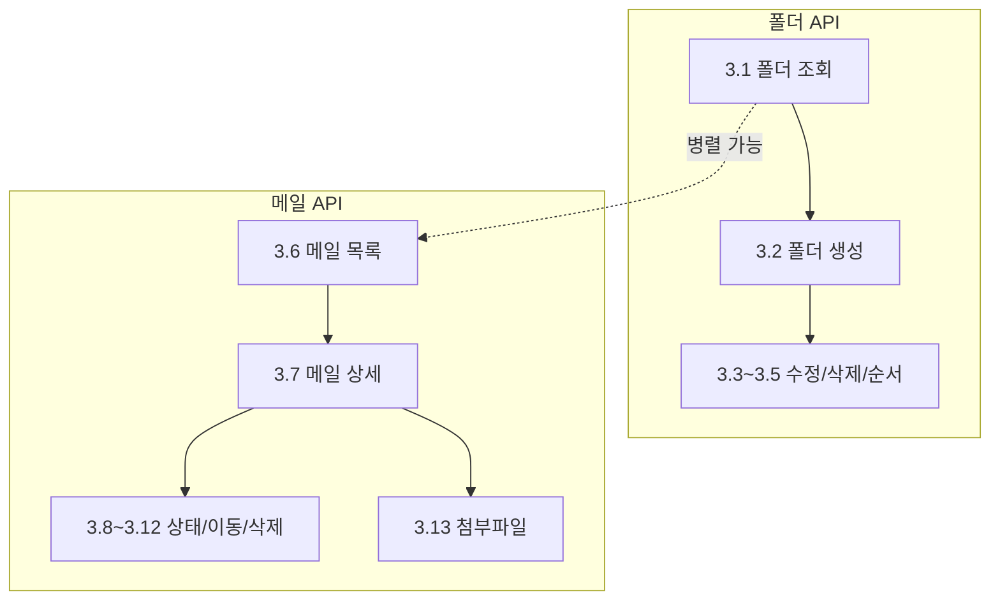

#### 완료 조건

- [ ] 모든 폴더 CRUD API 정상 작동
- [ ] 모든 메일 CRUD API 정상 작동
- [ ] 페이지네이션 정상 작동
- [ ] Swagger에서 모든 API 테스트 가능

---

### Phase 4: Gmail 동기화

**목표**: Gmail API 연동 및 메일 동기화

#### 작업 목록

| # | 작업 | 담당 | 의존성 | 산출물 |
|---|------|------|--------|--------|
| 4.1 | Gmail API 클라이언트 설정 | BE | Phase 2 | gmail_client.py |
| 4.2 | 메일 목록 가져오기 (messages.list) | BE | 4.1 | 동기화 로직 |
| 4.3 | 메일 상세 가져오기 (messages.get) | BE | 4.2 | 파싱 로직 |
| 4.4 | 메일 본문 파싱 (HTML/Plain) | BE | 4.3 | 파싱 유틸리티 |
| 4.5 | 첨부파일 메타데이터 추출 | BE | 4.3 | 첨부파일 로직 |
| 4.6 | 초기 동기화 로직 (6개월, 배치 20개) | BE | 4.4, 4.5 | sync_service.py |
| 4.7 | 증분 동기화 로직 (history API) | BE | 4.6 | incremental_sync.py |
| 4.8 | 동기화 상태 관리 | BE | 4.6 | SyncStatus 모델 |
| 4.9 | 동기화 시작 API | BE | 4.8 | `POST /sync/start/` |
| 4.10 | 동기화 상태 조회 API | BE | 4.8 | `GET /sync/status/` |
| 4.11 | 동기화 중단 API | BE | 4.8 | `POST /sync/stop/` |
| 4.12 | Rate Limiting 구현 | BE | 4.6 | rate_limiter.py |
| 4.13 | 백그라운드 폴링 (3분 주기) | BE | 4.7 | 스케줄러 |

#### 병렬 작업 가이드

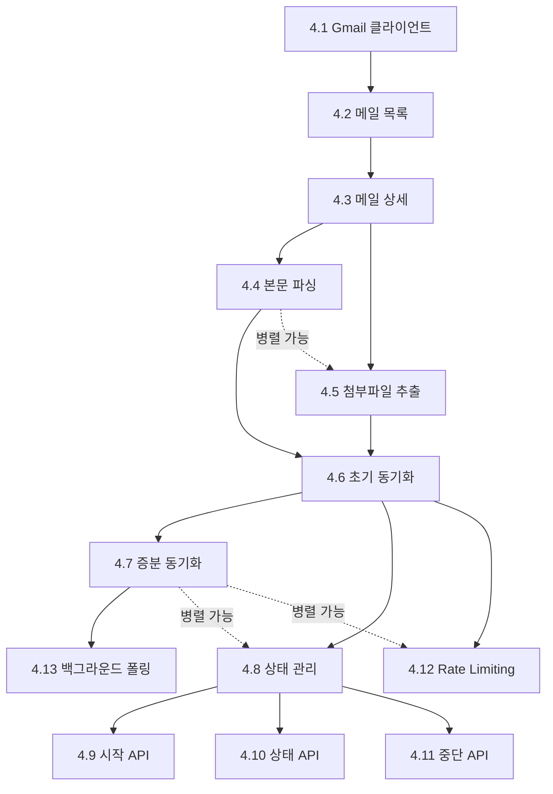

#### 완료 조건

- [ ] Gmail에서 6개월 메일 동기화 가능
- [ ] 동기화 진행률 조회 가능
- [ ] 동기화 중단 가능
- [ ] 새 메일 감지 (증분 동기화) 정상 작동

---

### Phase 5: AI 분류 시스템

**목표**: LLM을 활용한 메일 자동 분류

#### 작업 목록

| # | 작업 | 담당 | 의존성 | 산출물 |
|---|------|------|--------|--------|
| 5.1 | LangChain + Gemini 설정 | AI | Phase 1 | llm_client.py |
| 5.2 | 분류 프롬프트 설계 | AI | 5.1 | prompts.py |
| 5.3 | 폴더 추천 로직 (기존 폴더 매칭) | AI | 5.2 | classifier.py |
| 5.4 | 새 폴더 생성 로직 (필요시) | AI | 5.3 | folder_creator.py |
| 5.5 | 분류 서비스 구현 | AI | 5.3, 5.4 | classification_service.py |
| 5.6 | 분류 결과 저장 | AI | 5.5 | 분류 로직 |
| 5.7 | 분류 요청 API | BE | 5.5 | `POST /classification/classify/` |
| 5.8 | 분류 결과 조회 API | BE | 5.6 | `GET /classification/{id}/` |
| 5.9 | 미분류 일괄 분류 API | BE | 5.7 | `POST /classification/classify-unclassified/` |
| 5.10 | 분류 실패 처리 (1회 재시도 → 미분류) | AI | 5.5 | 에러 핸들링 |
| 5.11 | 동기화 시 자동 분류 연동 | AI | Phase 4, 5.5 | 연동 로직 |

#### 병렬 작업 가이드

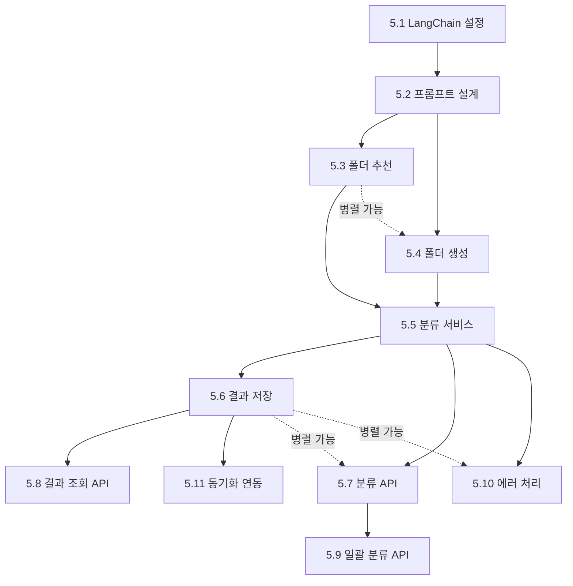

#### 완료 조건

- [ ] 메일 분류 시 적절한 폴더 추천
- [ ] 새 폴더 자동 생성 가능
- [ ] 분류 실패 시 "미분류" 처리
- [ ] 동기화 시 자동 분류 연동

---

### Phase 6: Frontend 개발

**목표**: 메일 클라이언트 UI 구현

#### 작업 목록

| # | 작업 | 담당 | 의존성 | 산출물 |
|---|------|------|--------|--------|
| 6.1 | 3단 레이아웃 구현 | FE | Phase 2 | layout.tsx |
| 6.2 | Header 컴포넌트 | FE | 6.1 | Header.tsx |
| 6.3 | StatusBar 컴포넌트 | FE | 6.1 | StatusBar.tsx |
| 6.4 | Sidebar (폴더 트리) | FE | 6.1 | Sidebar.tsx |
| 6.5 | VirtualFolders (전체/안읽음/별표/미분류) | FE | 6.4 | VirtualFolders.tsx |
| 6.6 | FolderTree 컴포넌트 | FE | 6.4 | FolderTree.tsx |
| 6.7 | FolderContextMenu | FE | 6.6 | FolderContextMenu.tsx |
| 6.8 | FolderMoveModal | FE | 6.6 | FolderMoveModal.tsx |
| 6.9 | MailList 컴포넌트 | FE | 6.1 | MailList.tsx |
| 6.10 | MailListItem 컴포넌트 | FE | 6.9 | MailListItem.tsx |
| 6.11 | MailPagination | FE | 6.9 | MailPagination.tsx |
| 6.12 | MailDetail 컴포넌트 | FE | 6.1 | MailDetail.tsx |
| 6.13 | AttachmentList | FE | 6.12 | AttachmentList.tsx |
| 6.14 | MailActions (이동/별표/삭제) | FE | 6.12 | MailActions.tsx |
| 6.15 | SyncButton | FE | 6.2 | SyncButton.tsx |
| 6.16 | SyncProgress (상태바 팝업) | FE | 6.3 | SyncProgress.tsx |
| 6.17 | Folder Store (Zustand) | FE | Phase 3 | folderStore.ts |
| 6.18 | Mail Store (Zustand) | FE | Phase 3 | mailStore.ts |
| 6.19 | Sync Store (Zustand) | FE | Phase 4 | syncStore.ts |
| 6.20 | API 클라이언트 (axios/fetch) | FE | Phase 3 | api/ 디렉토리 |
| 6.21 | 검색 기능 | FE | 6.9 | SearchInput.tsx |

#### 병렬 작업 가이드

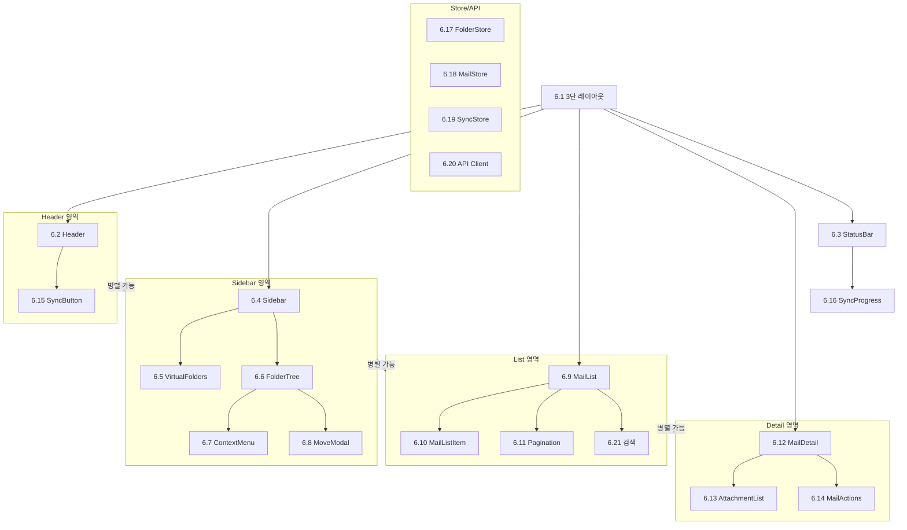

#### 완료 조건

- [ ] 3단 레이아웃 정상 표시
- [ ] 폴더 트리 표시 및 선택 가능
- [ ] 메일 목록 표시 및 페이지네이션
- [ ] 메일 상세 보기 가능
- [ ] 동기화 버튼 및 진행률 표시

---

### Phase 7: 통합 및 테스트

**목표**: 전체 시스템 통합 및 테스트

#### 작업 목록

| # | 작업 | 담당 | 의존성 | 산출물 |
|---|------|------|--------|--------|
| 7.1 | Backend-Frontend 통합 테스트 | ALL | Phase 6 | 테스트 결과 |
| 7.2 | E2E 플로우 테스트 (로그인 → 동기화 → 분류) | ALL | 7.1 | 테스트 시나리오 |
| 7.3 | 에러 핸들링 점검 | ALL | 7.1 | 에러 처리 로직 |
| 7.4 | 성능 최적화 | ALL | 7.2 | 최적화 결과 |
| 7.5 | 버그 수정 | ALL | 7.2 | 수정 커밋 |
| 7.6 | 코드 정리 및 리팩토링 | ALL | 7.5 | 클린 코드 |

#### 병렬 작업 가이드

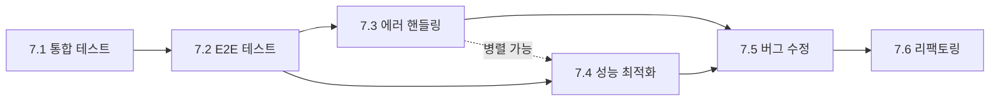

#### 완료 조건

- [ ] 전체 플로우 정상 작동
- [ ] 주요 에러 케이스 처리 완료
- [ ] 콘솔 에러 없음

---

### Phase 8: 배포

**목표**: 프로덕션 배포

#### 작업 목록

| # | 작업 | 담당 | 의존성 | 산출물 |
|---|------|------|--------|--------|
| 8.1 | Backend Railway 배포 설정 | BE | Phase 7 | railway.json |
| 8.2 | Frontend Vercel 배포 설정 | FE | Phase 7 | vercel.json |
| 8.3 | 환경변수 설정 (Production) | ALL | 8.1, 8.2 | 환경변수 |
| 8.4 | 도메인 연결 (선택) | ALL | 8.3 | 커스텀 도메인 |
| 8.5 | 최종 테스트 | ALL | 8.4 | 배포 확인 |

#### 병렬 작업 가이드

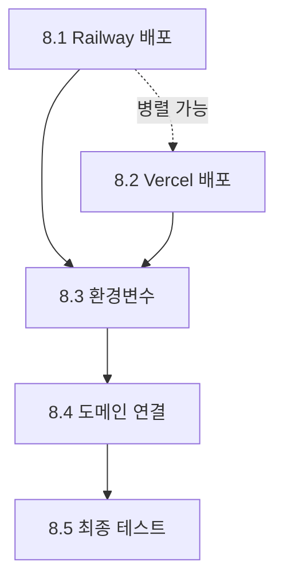

#### 완료 조건

- [ ] Backend API 배포 URL 접속 가능
- [ ] Frontend 배포 URL 접속 가능
- [ ] 프로덕션 환경에서 전체 플로우 정상 작동

---

## 4. 전체 의존성 그래프

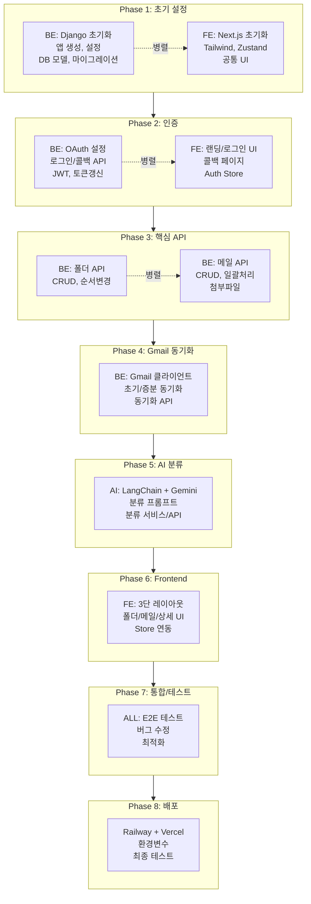

---

## 5. Squad 역할 분담

### 5.1 Backend Agent (BE)

**담당 범위**:
- Django 프로젝트 설정 및 앱 구성
- DB 모델 정의 및 마이그레이션
- REST API 개발 (DRF)
- OAuth2 인증 구현
- Gmail API 연동 및 동기화
- Rate Limiting
- Swagger 문서화

**참조 문서**:
- `API_SPEC.md`
- `DATABASE.md`
- `DECISIONS.md`

### 5.2 Frontend Agent (FE)

**담당 범위**:
- Next.js 프로젝트 설정
- 컴포넌트 개발
- 상태 관리 (Zustand)
- API 연동
- UI/UX 구현

**참조 문서**:
- `UI_SPEC.md`
- `DECISIONS.md`

### 5.3 AI Agent (AI)

**담당 범위**:
- LangChain 설정
- Gemini API 연동
- 분류 프롬프트 설계
- 분류 로직 구현
- 에러 핸들링

**참조 문서**:
- `DECISIONS.md` (ADR-005)
- `API_SPEC.md` (분류 API)

---

## 6. 체크포인트 (동기화 시점)

각 Phase 완료 후 동기화 필요:

| Phase | 체크포인트 | 확인 사항 |
|-------|-----------|----------|
| Phase 1 완료 | 프로젝트 구조 확인 | BE/FE 프로젝트 실행 가능 |
| Phase 2 완료 | 인증 테스트 | 로그인 후 토큰 발급 확인 |
| Phase 3 완료 | API 테스트 | Swagger에서 모든 API 테스트 |
| Phase 4 완료 | 동기화 테스트 | Gmail 메일 동기화 확인 |
| Phase 5 완료 | 분류 테스트 | 메일 분류 결과 확인 |
| Phase 6 완료 | UI 테스트 | 전체 UI 플로우 확인 |
| Phase 7 완료 | 통합 테스트 | E2E 플로우 확인 |
| Phase 8 완료 | 배포 확인 | 프로덕션 URL 접속 |

---

## 7. 작업 우선순위 매트릭스

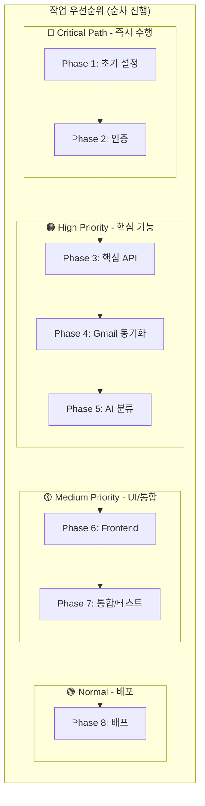

### 우선순위 상세

| 우선순위 | Phase | 긴급도 | 중요도 | 비고 |
|----------|-------|--------|--------|------|
| 🔴 Critical | Phase 1, 2 | 높음 | 높음 | 다른 모든 작업의 선행 조건 |
| 🟠 High | Phase 3, 4, 5 | 높음 | 높음 | 핵심 비즈니스 로직 |
| 🟡 Medium | Phase 6, 7 | 중간 | 높음 | UI 및 품질 보증 |
| 🟢 Normal | Phase 8 | 낮음 | 중간 | 최종 단계 |

---

## 8. 관련 문서

- [시스템 아키텍처](./ARCHITECTURE.md)
- [API 명세서](./API_SPEC.md)
- [데이터베이스 설계](./DATABASE.md)
- [UI 설계](./UI_SPEC.md)
- [기술 결정 기록](./DECISIONS.md)

---

*이 문서는 프로젝트 진행에 따라 지속적으로 업데이트됩니다.*
